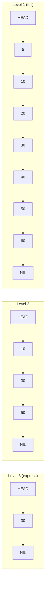

# Module 05 — SkipList & Ordered Structures

> Source: [skip_list.h](../../../minikv/src/core/skip_list.h) (MemTable backend), [internal_key.h](../../../minikv/src/core/internal_key.h)
> LeetCode: [1206. Design Skiplist](https://leetcode.com/problems/design-skiplist/)

## Background & Motivation

Why do LevelDB, RocksDB, and Redis all reach for a SkipList when they need an in-memory ordered structure? You might expect a red-black tree — after all, it guarantees O(log n) in the worst case, while SkipList only offers that in expectation. But in practice, the SkipList wins on three counts that matter in production: it's dramatically simpler to implement, it locks only locally so concurrent reads scale beautifully, and its bottom linked list makes range scans a straight-line walk. Probabilistic balancing sounds sketchy until you realize the math is on your side — the expected path length is rock solid, and Redis's `zset` has been running this bet in production for years.

This is Module 05, the payoff of the concurrency vocabulary from Module 03 and the C++ syntax from Module 02. We dissect minikv's SkipList end to end — the node structure, the search and insert algorithms, the `randomLevel` function with its `thread_local` RNG, and the `shared_mutex` that gates concurrent access. This is also the data structure that backs the MemTable, so everything here feeds directly into how writes become SSTables on disk later in the course.

After this module, you'll be able to answer "Why a SkipList over a red-black tree for a MemTable?", "How does probabilistic balancing achieve O(log n)?", "Why is the RNG thread_local?", and "How would you make a SkipList thread-safe?" The LeetCode 1206 design problem will feel routine, and you'll have a concrete, defensible answer to the classic "design an ordered in-memory KV" interview question.

## 1. Core Knowledge

- SkipList essence: multi-level ordered linked lists; upper levels are "express lanes" for lower levels; uses probability instead of rotations to stay balanced.
- Search/insert/delete: expected O(log n), worst-case O(n); space O(n).
- Random level: `while (rand() < p && level < kMaxLevel) level++`; expected level count is O(log n).
- Comparison with RB-tree/B+tree: simpler implementation, concurrency-friendly, excellent range queries.
- Engineering in minikv's SkipList: `shared_mutex` RW lock, `thread_local` RNG, memory-usage accounting.

## 2. Deep Dive

### 2.1 Why MemTable Uses a SkipList

A MemTable in an LSM-Tree needs to:

1. **Stay ordered**: flushing to SSTable requires ordered key output.
2. **Handle read+write heavy**: every Put inserts, every Get searches.
3. **Be concurrency-friendly**: multi-threaded reads/writes.
4. **Support range scans**: iterators traverse in order.

A red-black tree also fits, but a SkipList wins because:

- Far simpler than an RB-tree (no rotations/recoloring).
- Concurrency-friendly: modifications need only local fine-grained locking; RB-tree rotations rebalance multiple nodes.
- Range queries: the bottom linked list scans in order, cache-friendly.
- LevelDB/RocksDB MemTables all use SkipLists — proven at industrial scale.

### 2.2 SkipList Structure

```
Level 3:  HEAD ──────────────────────► 30 ──────────────────────► NIL
Level 2:  HEAD ────────► 10 ──────────► 30 ──────────► 50 ──────► NIL
Level 1:  HEAD ──► 5 ──► 10 ──► 20 ──► 30 ──► 40 ──► 50 ──► 60 ─► NIL
```



- Each node has a `forward[]` array; `forward[i]` points to the next node on level i.
- The head node `head_` occupies all `kMaxLevel+1` levels and is the search starting point.
- Upper-level nodes are a subset of lower-level nodes, generated probabilistically.

### 2.3 minikv's SkipList Implementation

[skip_list.h:15-21](../../../minikv/src/core/skip_list.h) defines the node:

```cpp
struct SkipNode {
    std::string key;        // actually the InternalKey-encoded string
    std::string value;
    std::vector<SkipNode*> forward;   // forward[i] = successor on level i
    SkipNode(std::string k, std::string v, int level)
        : key(std::move(k)), value(std::move(v)), forward(level + 1, nullptr) {}
};
```

Note `forward(level + 1, nullptr)`: level is 0-indexed, the count of levels is level+1, so `forward` size = number of levels.

### 2.4 Search Algorithm

[skip_list.h:68-79](../../../minikv/src/core/skip_list.h):

```cpp
std::optional<std::string> get(const std::string& key) const {
    std::shared_lock<std::shared_mutex> lock(mutex_);   // read lock
    SkipNode* x = head_;
    for (int i = max_level_; i >= 0; --i) {            // top down
        while (x->forward[i] &&
               InternalKeyCompare(Slice(x->forward[i]->key), Slice(key)) < 0)
            x = x->forward[i];                          // move right on this level
    }
    x = x->forward[0];                                  // descend to level 0 candidate
    if (x && x->key == key) return x->value;
    return std::nullopt;
}
```

Flow: start at the top level `max_level_`, move right on each level to the greatest node less than key, then drop one level. The level-0 candidate is the target or absent.

**Why `InternalKeyCompare` instead of `strcmp`**: under MVCC the key is `[user_key | trailer(8)]`-encoded; comparison must first compare user_key then seq (descending) — see Module 08.

### 2.5 Insert Algorithm

[skip_list.h:38-66](../../../minikv/src/core/skip_list.h):

```cpp
void put(const std::string& key, const std::string& value) {
    std::unique_lock<std::shared_mutex> lock(mutex_);   // write lock
    std::vector<SkipNode*> update(kMaxLevel + 1, nullptr);  // predecessor per level
    SkipNode* x = head_;
    for (int i = max_level_; i >= 0; --i) {
        while (x->forward[i] && InternalKeyCompare(...) < 0) x = x->forward[i];
        update[i] = x;                                  // record predecessor
    }
    x = x->forward[0];
    if (x && x->key == key) {                           // exists: update value
        mem_usage_ -= x->value.size();
        x->value = value;
        mem_usage_ += value.size();
    } else {                                            // absent: create node
        int level = randomLevel();
        if (level > max_level_) {
            for (int i = max_level_ + 1; i <= level; ++i) update[i] = head_;
            max_level_ = level;
        }
        auto* node = new SkipNode(key, value, level);
        for (int i = 0; i <= level; ++i) {              // splice in per level
            node->forward[i] = update[i]->forward[i];
            update[i]->forward[i] = node;
        }
        mem_usage_ += sizeof(SkipNode) + key.size() + value.size();
    }
}
```

Key points:

- **`update[]` array**: records the predecessor at each level; insertion just reconnects predecessors' forward pointers.
- **Update if exists**: overwrites are common in LSM (here "same key" means same InternalKey).
- **New node level**: decided by `randomLevel()`; levels above `max_level_` get head_ as predecessor.
- **Memory accounting**: `mem_usage_` accumulates so `maybeFlush` can decide when to flush.

### 2.6 Random Level

[skip_list.h:125-131](../../../minikv/src/core/skip_list.h):

```cpp
int randomLevel() {
    static thread_local std::mt19937 rng(std::random_device{}());
    static thread_local std::uniform_int_distribution<int> dist(0, 1);
    int level = 0;
    while (dist(rng) && level < kMaxLevel) ++level;   // p = 0.5
    return level;
}
```

- `thread_local`: each thread has its own RNG, avoiding contention + false sharing.
- `p = 0.5`: 50% chance to promote per level; expected level count `E = 1/(1-p) = 2`, capped at `kMaxLevel = 32` to prevent runaway.
- Probability proof: the probability a node appears on level k is `p^k`; expected nodes on level k = `n·p^k`; total expected space = `n/(1-p) = 2n` (O(n)).
- Search expected complexity: at each level expect to walk `1/p` steps before descending, across O(log n) levels, total O(log n / p) = O(log n).

### 2.7 Comparison: SkipList vs RB-tree vs B+tree

| Aspect | SkipList | RB-tree | B+tree |
|---|---|---|---|
| Balancing | probability | rotation+color | split+merge |
| Implementation complexity | low | high | high |
| Search complexity | O(log n) expected | O(log n) worst | O(log_B n) |
| Range query | linked-list scan, excellent | in-order traversal, medium | leaf chain, excellent |
| Concurrency-friendly | local locks, excellent | rotations hard to lock, poor | page locks, medium |
| Disk-friendly | no (in-memory) | no (in-memory) | yes (page-aligned) |
| Typical use | LevelDB/RocksDB MemTable, Redis zset | std::map, Java TreeMap | MySQL InnoDB, Postgres |

Mnemonic: **in-memory + high concurrency → SkipList; disk + read-heavy → B+tree; general in-memory → RB-tree**.

### 2.8 Deletion and Memory Management

`del` in [skip_list.h:81-101](../../../minikv/src/core/skip_list.h): similarly uses `update[]` to find predecessors, unlinks per level, `delete`s the node, and shrinks `max_level_`.

The destructor [skip_list.h:29-36](../../../minikv/src/core/skip_list.h) walks the level-0 list and `delete`s each node — O(n) release. This is the cost of raw-pointer management; switching to a `unique_ptr` chain would be safer but adds complexity.

## 3. Thinking Questions

1. How does "probabilistic balancing" guarantee O(log n)? What happens if the RNG degrades (always returns 0)?
2. minikv's `randomLevel` uses a `thread_local` RNG. What goes wrong with a global `static` RNG?
3. `put` updates the value if the key exists rather than inserting a new node. Does this conflict with the LSM "multiple versions per key" philosophy? Why?
4. The level-0 candidate is checked with `x->key == key`. Why not `InternalKeyCompare(...) == 0`? Are they equivalent?
5. `forward` is a `std::vector<SkipNode*>` rather than a raw array. What's the trade-off?

## 4. Hands-on Exercises

### Exercise 4.1 (Hand-write SkipList, LeetCode 1206)

Without looking at the source, implement `Skiplist` with `search / add / erase` and pass LeetCode 1206. Require: p=0.5, max level 16.

### Exercise 4.2 (Concurrency-Safe SkipList)

Following [skip_list.h](../../../minikv/src/core/skip_list.h), implement an RW-locked SkipList with `shared_mutex`. Benchmark: 10 threads each Put 100k keys + 10 threads each Get 100k keys; compare RW-lock vs plain mutex throughput.

### Exercise 4.3 (SkipList Iterator)

Implement a forward iterator `class SkipListIterator` for minikv's SkipList: `seek(key)` (position at first >= key), `next()`, `valid()`, `key()`, `value()`. Careful: while the iterator holds a read lock, how do you avoid deadlock? (Hint: snapshot copy vs long-held lock.)

### Exercise 4.4 (Complexity Analysis)

Prove: in a p=0.5 SkipList, the expected number of comparisons on search is < 2·log₂(n) + O(1). (Hint: reverse analysis — trace from the target node back to head; each step is "left or up" with equal probability.)

## 5. Self-Check

1. A SkipList stays balanced via ____; an RB-tree via ____.
2. minikv's SkipList `kMaxLevel` = ____.
3. In `put`, `update[i]` records the ____ at the insertion point on level i.
4. `randomLevel` uses `thread_local` to avoid ____.
5. SkipList expected space is O(____); expected search is O(____).

<details>
<summary>Reference Answers</summary>

1. probability (random levels); rotation+color
2. 32
3. predecessor node
4. multi-thread contention on RNG state (and false sharing)
5. n; log n

Thinking question key points:
1. Each level's expected node count is p times the previous, forming a geometric series; the total search path is expected O(log n). RNG degrading to always 0 → all nodes on level 0 → degrades to a sorted linked list, search O(n).
2. A global RNG under multi-threading either needs locking (slow) or causes a data race (UB). thread_local gives each thread its own, no contention.
3. No conflict. The MemTable dedups on "identical InternalKey" (same user_key + same seq); the same user_key with different seq is a different InternalKey and creates a new node forming a version chain. The "update" here targets a fully identical InternalKey (which shouldn't really happen since seq is monotonic).
4. Equivalent. `==` is byte-wise (string's operator==); InternalKeyCompare==0 is also equality on the encoding. `==` is more direct and saves a function call.
5. A vector is flexible (level decided at runtime) and safe (auto memory); the cost is heap allocation + slightly worse cache locality. SkipList nodes are heap-allocated anyway, so the extra vector overhead is acceptable. LevelDB uses a fixed array `std::atomic<void*> next_[1]` (flexible array member) to optimize.

</details>

---

← [Module 04](./04-go-ts.md)  |  Next: [Module 06 — BloomFilter & Hashing](./06-bloom-hash.md) →
