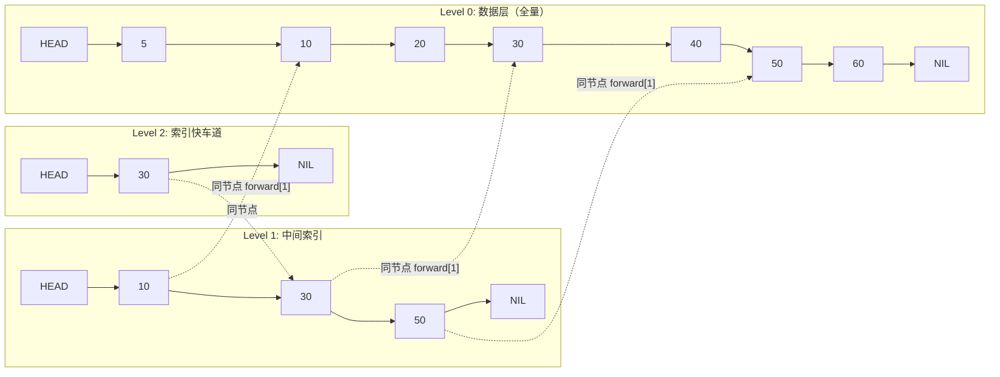

# Module 05 — 跳表与有序结构

> 对应源码：[skip_list.h](../../../minikv/src/core/skip_list.h)（MemTable 后端）、[internal_key.h](../../../minikv/src/core/internal_key.h)
> 对应 LeetCode：[1206. 设计跳表](https://leetcode.cn/problems/design-skiplist/)

## 背景与动机

每次讲到跳表，我们都会先抛一个反问：「既然红黑树已经在 std::map 里证明了自己，为什么 LevelDB、RocksDB、Redis zset 都偏要选跳表？」答案不在复杂度上——期望都是 O(log n)——而在工程上：跳表实现比红黑树简单一半、并发加锁只动局部节点、范围扫描就是底层链表一遍走完。工业界选数据结构，从来不是看 Big-O 谁更漂亮，而是看「能不能在 200 行代码里写完、能不能细粒度加锁、能不能配合 LSM 的 flush 顺序遍历」。跳表在这三条上都赢。

这一模块是 TitanKV 课程的「数据结构主战场」：前面 Module 02 讲了 Slice 比较、Module 03 讲了 `shared_mutex`，到这里它们要一起上阵——SkipList 的 `get` 用 `shared_lock`、`put` 用 `unique_lock`、比较用 `InternalKeyCompare`。换句话说，跳表是前面所有 C++ 知识的「综合考试题」，把这一模块吃透，你对前两模块的理解会再上一个台阶。这一节既是数据结构课，也是前两模块的「回头看」。

学完之后，你应该能在白板上手撕一个跳表的 `put`/`get`/`del`，并讲清这几件事：随机层数为什么用 p=0.5、`update[]` 数组为什么必须记前驱、`thread_local` RNG 为什么比全局 RNG 好、为什么 Redis 的 zset 也选跳表而不是红黑树。LeetCode 1206 这道题，过不过得了，是这一模块学得扎不扎实的硬指标。写完手撕版本再去读 minikv 源码，你会发现工业级实现和教科书版本的差距。

## 1. 核心知识

- 跳表本质：多层有序链表，上层是下层的「索引快车道」，用概率代替旋转维持平衡。
- 查找/插入/删除：期望 O(log n)，最坏 O(n)；空间 O(n)。
- 随机层数：`while (rand() < p && level < kMaxLevel) level++`，期望层数 O(log n)。
- 与红黑树/B+ 树对比：实现简单、并发友好、范围查询优秀。
- minikv SkipList 的工程化：`shared_mutex` 读写锁、`thread_local` RNG、内存占用统计。

## 2. 内容详解

### 2.1 为什么 MemTable 用跳表

LSM-Tree 的 MemTable 需要：

1. **有序**：flush 成 SSTable 必须按 key 有序输出。
2. **写多读多**：每次 Put 都插入，Get 也要查。
3. **并发友好**：多线程读写。
4. **范围扫描**：迭代器按序遍历。

红黑树也能满足，但跳表优势：

- 实现比红黑树简单得多（无需旋转/着色）。
- 并发友好：跳表修改只需局部加锁（细粒度），红黑树旋转涉及多节点重平衡。
- 范围查询：底层链表顺序遍历，缓存友好。
- LevelDB/RocksDB 的 MemTable 都用跳表，已验证工业级可靠。

### 2.2 跳表结构

```
Level 3:  HEAD ──────────────────────► 30 ──────────────────────► NIL
Level 2:  HEAD ────────► 10 ──────────► 30 ──────────► 50 ──────► NIL
Level 1:  HEAD ──► 5 ──► 10 ──► 20 ──► 30 ──► 40 ──► 50 ──► 60 ─► NIL
```

- 每个节点有 `forward[]` 数组，`forward[i]` 指向第 i 层的下一个节点。
- 头节点 `head_` 占满 `kMaxLevel+1` 层，是查找起点。
- 上层节点是下层节点的子集，靠概率生成。

用 Mermaid 把这张 ASCII 图重画一次，节点之间在不同层的「同节点」关系用虚线标出，能更清楚地看到 `forward[]` 数组其实是在每个节点内部维护多条横向指针：



查找时从 `max_level_` 出发，每层向右走到比 key 小的最远节点再下降，最后落到 Level 0 的候选节点——这就是跳表能用 O(log n) 跳过中间节点的几何直觉。

### 2.3 minikv 的 SkipList 实现

[skip_list.h:15-21](../../../minikv/src/core/skip_list.h) 定义节点：

```cpp
struct SkipNode {
    std::string key;        // 实际是 InternalKey 编码后的字符串
    std::string value;
    std::vector<SkipNode*> forward;   // forward[i] = 第 i 层后继
    SkipNode(std::string k, std::string v, int level)
        : key(std::move(k)), value(std::move(v)), forward(level + 1, nullptr) {}
};
```

注意 `forward(level + 1, nullptr)`：level 是 0-indexed，层数 = level+1，`forward` 大小 = 层数。

### 2.4 查找算法

[skip_list.h:68-79](../../../minikv/src/core/skip_list.h)：

```cpp
std::optional<std::string> get(const std::string& key) const {
    std::shared_lock<std::shared_mutex> lock(mutex_);   // 读锁
    SkipNode* x = head_;
    for (int i = max_level_; i >= 0; --i) {            // 从最高层往下
        while (x->forward[i] &&
               InternalKeyCompare(Slice(x->forward[i]->key), Slice(key)) < 0)
            x = x->forward[i];                          // 同层右移
    }
    x = x->forward[0];                                  // 下降到第 0 层候选
    if (x && x->key == key) return x->value;
    return std::nullopt;
}
```

流程：从最高层 `max_level_` 出发，每层向右走到比 key 小的最大节点，然后下降一层。第 0 层的候选即目标或不存在。

**为什么用 `InternalKeyCompare` 而非 `strcmp`**：MVCC 后 key 是 `[user_key | trailer(8)]` 编码，比较需先比 user_key 再比 seq（降序），见 Module 08。

### 2.5 插入算法

[skip_list.h:38-66](../../../minikv/src/core/skip_list.h)：

```cpp
void put(const std::string& key, const std::string& value) {
    std::unique_lock<std::shared_mutex> lock(mutex_);   // 写锁
    std::vector<SkipNode*> update(kMaxLevel + 1, nullptr);  // 记录每层插入点前驱
    SkipNode* x = head_;
    for (int i = max_level_; i >= 0; --i) {
        while (x->forward[i] && InternalKeyCompare(...) < 0) x = x->forward[i];
        update[i] = x;                                  // 记下前驱
    }
    x = x->forward[0];
    if (x && x->key == key) {                           // 已存在：更新 value
        mem_usage_ -= x->value.size();
        x->value = value;
        mem_usage_ += value.size();
    } else {                                            // 不存在：新建节点
        int level = randomLevel();
        if (level > max_level_) {
            for (int i = max_level_ + 1; i <= level; ++i) update[i] = head_;
            max_level_ = level;
        }
        auto* node = new SkipNode(key, value, level);
        for (int i = 0; i <= level; ++i) {              // 逐层串入
            node->forward[i] = update[i]->forward[i];
            update[i]->forward[i] = node;
        }
        mem_usage_ += sizeof(SkipNode) + key.size() + value.size();
    }
}
```

要点：

- **`update[]` 数组**：记录每层插入点的前驱，插入时只需重连前驱的 forward。
- **已存在则更新**：LSM 里同 key 覆盖是常态（实则 InternalKey 带 seq 不同，这里同 key 指同 InternalKey）。
- **新节点层数**：`randomLevel()` 决定，超过 `max_level_` 的层前驱设为 head_。
- **内存统计**：`mem_usage_` 累加，供 `maybeFlush` 判断是否触发刷盘。

### 2.6 随机层数

[skip_list.h:125-131](../../../minikv/src/core/skip_list.h)：

```cpp
int randomLevel() {
    static thread_local std::mt19937 rng(std::random_device{}());
    static thread_local std::uniform_int_distribution<int> dist(0, 1);
    int level = 0;
    while (dist(rng) && level < kMaxLevel) ++level;   // p = 0.5
    return level;
}
```

- `thread_local`：每个线程独立 RNG，避免多线程竞争 + false sharing。
- `p = 0.5`：每层以 50% 概率提升，期望层数 `E = 1/(1-p) = 2`，但最大 `kMaxLevel = 32` 保证不失控。
- 概率证明：节点出现在第 k 层的概率 = `p^k`，第 k 层期望节点数 = `n·p^k`，总期望空间 = `n/(1-p) = 2n`（O(n)）。
- 查找期望复杂度：每层期望走 `1/p` 步后下降，共 O(log n) 层，总 O(log n / p) = O(log n)。

### 2.7 与红黑树 / B+ 树对比

| 维度 | 跳表 | 红黑树 | B+ 树 |
|---|---|---|---|
| 平衡方式 | 概率 | 旋转+着色 | 分裂+合并 |
| 实现复杂度 | 低 | 高 | 高 |
| 查找复杂度 | O(log n) 期望 | O(log n) 最坏 | O(log_B n) |
| 范围查询 | 链表顺序遍历，优 | 中序遍历，中 | 叶子链表，优 |
| 并发友好 | 局部锁，优 | 旋转难加锁，差 | 页锁，中 |
| 磁盘友好 | 否（内存） | 否（内存） | 是（页对齐） |
| 典型应用 | LevelDB/RocksDB MemTable、Redis zset | std::map、Java TreeMap | MySQL InnoDB、Postgres |

选型口诀：**内存 + 高并发 → 跳表；磁盘 + 读多 → B+ 树；通用内存 → 红黑树**。

### 2.8 删除与内存管理

[skip_list.h:81-101](../../../minikv/src/core/skip_list.h) 的 `del`：同样用 `update[]` 找前驱，逐层摘除后 `delete` 节点，并回缩 `max_level_`。

析构函数 [skip_list.h:29-36](../../../minikv/src/core/skip_list.h) 沿第 0 层链表逐个 `delete`——O(n) 释放。这是裸指针管理的代价；若改用 `unique_ptr` 链则更安全但增加复杂度。

## 3. 思考题

1. 跳表的「概率平衡」为什么能保证 O(log n)？如果 RNG 退化（总返回 0），会发生什么？
2. minikv 的 `randomLevel` 用 `thread_local` RNG，如果改成全局 `static` RNG 会有什么问题？
3. `put` 里「已存在则更新 value」而不新建节点，这和 LSM 的「同 key 多版本」哲学是否冲突？为什么？
4. 跳表查找第 0 层候选时用 `x->key == key`，为什么不用 `InternalKeyCompare(...) == 0`？二者等价吗？
5. 跳表的 `forward` 用 `std::vector<SkipNode*>` 而非裸数组，有什么权衡？

## 4. 动手题

### 题 4.1（手撕跳表，LeetCode 1206）

不参考源码，实现 `Skiplist` 的 `search / add / erase`，通过 LeetCode 1206。要求：随机层数 p=0.5，最大层数 16。

### 题 4.2（并发安全跳表）

参考 [skip_list.h](../../../minikv/src/core/skip_list.h)，用 `shared_mutex` 实现读写锁版跳表。写一个基准测试：10 线程各 Put 10 万 key + 10 线程各 Get 10 万 key，对比读写锁 vs 普通 mutex 的吞吐。

### 题 4.3（跳表迭代器）

为 minikv SkipList 实现一个前向迭代器 `class SkipListIterator`，支持 `seek(key)`（定位到 >= key 的第一个）、`next()`、`valid()`、`key()`、`value()`。注意：迭代器持有读锁期间，如何避免死锁？（提示：拷贝快照 vs 长持锁）

### 题 4.4（复杂度分析）

证明：在 p=0.5 的跳表中，查找的期望比较次数 < 2·log₂(n) + O(1)。（提示：逆向分析，从目标节点回溯到 head，每步「向左或向上」概率各半。）

## 5. 自检

1. 跳表通过____维持平衡，红黑树通过____维持平衡。
2. minikv SkipList 的最大层数 `kMaxLevel` = ____。
3. `put` 时 `update[i]` 记录的是第 i 层插入点的____。
4. `randomLevel` 用 `thread_local` 是为了避免____。
5. 跳表期望空间复杂度 O(____)，查找期望 O(____)。

<details>
<summary>参考答案</summary>

1. 概率（随机层数）；旋转+着色
2. 32
3. 前驱节点
4. 多线程竞争 RNG 状态（以及 false sharing）
5. n；log n

思考题要点：
1. 每层节点数期望为上层的 p 倍，形成几何级数，总查找路径期望 O(log n)。RNG 退化总返回 0 → 所有节点都在第 0 层 → 退化为有序链表，查找 O(n)。
2. 全局 RNG 多线程下要么加锁（性能差）要么数据竞争（UB）。thread_local 每线程独立，无竞争。
3. 不冲突。MemTable 层面对「相同 InternalKey」去重（同 user_key + 同 seq），不同 seq 的同 user_key 是不同 InternalKey，会新建节点形成版本链。这里的「更新」针对完全相同的 InternalKey（理论上不应发生，因 seq 单调递增）。
4. 二者等价。`==` 是按字节比较（string 的 operator==），InternalKeyCompare==0 也是按编码比较相等。但用 `==` 更直接，省一次函数调用。
5. vector 灵活（运行期决定层数）、安全（自动管理内存）；代价是堆分配 + 缓存局部性略差。跳表节点本身是堆分配，vector 的额外开销相对可接受；LevelDB 用定长数组 `std::atomic<void*> next_[1]` 柔性数组优化。

</details>

---

← [Module 04](./04-go-ts.md)  |  下一模块：[Module 06 — 布隆过滤器与哈希](./06-bloom-hash.md) →
