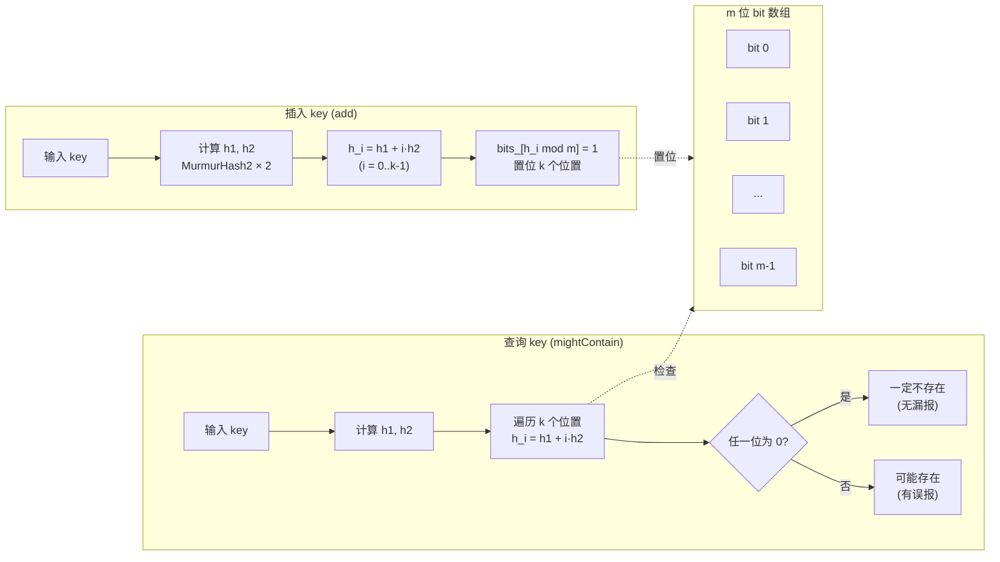

# Module 06 — 布隆过滤器与哈希

> 对应源码：[bloom_filter.h](../../../minikv/src/core/bloom_filter.h)、[hash.h](../../../minikv/src/utils/hash.h)
> 对应规划：分布式层一致性哈希分片（REFACTORING.md Phase 5）

## 背景与动机

我们在前一个模块里把 MemTable 用跳表跑起来了，写路径看起来挺漂亮——内存里一插就完事。可一旦数据落盘成 SSTable，读放大这个隐藏的怪兽就张开了嘴：一次 `Get` 可能要查 MemTable、Immutable、L0 的好几个重叠文件，再到 L1..Ln 逐层二分，层层磁盘 IO，延迟瞬间被拉到毫秒级。这就是 LSM-Tree「写快读慢」的原罪，也是 Cassandra、HBase、LevelDB 都逃不开的痛点。

那有没有办法在读 SSTable 之前先「便宜地」判断一下 key 到底在不在？这就是布隆过滤器登场的地方——它用一个 m 位的 bit 数组和 k 个哈希函数，以极小的内存代价（约 1% 误判率只需 ~10 bit/key）把 99% 不存在的查询挡在磁盘之外。它用「概率」换「性能」，无漏报、有误报，这个优雅的权衡正是分布式存储里最经典的设计之一。同时我们还会顺带讲一致性哈希——它和布隆一样是「哈希」家族，但解决的是分片路由问题，为后面 Module 11 的 Raft 分片埋下伏笔。

学完这一模块，你应该能在面试里讲清楚：布隆过滤器的误判率公式怎么推导、为什么用双哈希优化、MurmurHash2 为何比 SHA-256 更适合 LSM 内部，以及一致性哈希为什么需要虚拟节点。更重要的是，你会明白 minikv 里 `BloomFilter` 这个不到 80 行的小类，是怎么撑起整个读路径性能的。

## 1. 核心知识

- 布隆过滤器：m 位 bit 数组 + k 个哈希函数；插入置位、查询全 1 才「可能存在」。
- 性质：**无漏报（False Negative = 0），有误报（False Positive > 0）**；不支持删除。
- 误判率公式：`p ≈ (1 - e^(-kn/m))^k`；最优 `k = (m/n)·ln2`，`m = -n·ln(p)/(ln2)²`。
- 双哈希优化（Kirsch-Mitzenmacher）：用 2 个哈希模拟 k 个，`h_i(x) = h1(x) + i·h2(x)`。
- MurmurHash2：非加密哈希，分布均匀、速度快，适合哈希表/布隆过滤器。
- 一致性哈希：环 + 顺时针查找 + 虚拟节点；增删节点只迁移相邻段。

## 2. 内容详解

### 2.1 为什么 LSM-Tree 需要 Bloom Filter

LSM 读路径要查 MemTable → Immutable → L0（重叠）→ L1..Ln。每层 SSTable 都可能要二分查找，读放大严重。

Bloom Filter 在读 SSTable 前先过滤：若 BF 说「不存在」，直接跳过该 SSTable，省一次磁盘读。由于 BF 无漏报，不会漏掉真实存在的 key。

#### 布隆过滤器工作流程



插入时 k 个哈希位置全部置 1；查询时只要有一位为 0 就判定「一定不存在」，全为 1 才判定「可能存在」。双哈希优化让我们只需算 2 次 MurmurHash2 即可模拟 k 个哈希函数。

### 2.2 minikv BloomFilter 构造

[bloom_filter.h:17-26](../../../minikv/src/core/bloom_filter.h)：

```cpp
BloomFilter(size_t expected_keys, double false_positive_rate = 0.01) {
    int bits = static_cast<int>(-1.0 * std::log(fpr) / std::log(2.0) / std::log(2.0));  // m/n = -ln(p)/(ln2)^2
    num_hashes_ = static_cast<int>(bits * std::log(2.0));   // k = (m/n)·ln2
    if (num_hashes_ < 1) num_hashes_ = 1;
    if (num_hashes_ > 30) num_hashes_ = 30;                  // 上限保护
    bits_per_key_ = static_cast<int>(bits / std::log(2.0));
    bits_.assign(expected_keys * bits_per_key_ / 8 + 1, 0);
}
```

参数推导（面试常考）：

- 给定 n（期望 key 数）和 p（目标误判率），求最优 m 和 k。
- 误判率 `p = (1 - e^(-kn/m))^k`，对 k 求导令其为 0 得 `k = (m/n)·ln2`。
- 代回得 `m = -n·ln(p)/(ln2)²`。
- 例：n=100 万、p=1% → m ≈ 9.6M bit ≈ 1.17MB，k ≈ 7。

minikv 把 `num_hashes_` 上限设 30，避免极端参数下哈希次数过多反而变慢。

### 2.3 双哈希优化

[bloom_filter.h:28-36](../../../minikv/src/core/bloom_filter.h)：

```cpp
void add(const Slice& key) {
    uint32_t h1 = utils::murmurHash2(key.data(), key.size(), 0xbc9f1d34);
    uint32_t h2 = utils::murmurHash2(key.data(), key.size(), 0x9e3779b9);
    uint32_t bits = static_cast<uint32_t>(bits_.size() * 8);
    for (int i = 0; i < num_hashes_; ++i) {
        uint32_t pos = (h1 + i * h2) % bits;        // 双哈希：h_i = h1 + i·h2
        bits_[pos / 8] |= (1 << (pos % 8));
    }
}
```

- **Kirsch-Mitzenmacher 定理**：用两个独立哈希 `h1`、`h2` 线性组合 `h_i = h1 + i·h2` 可近似 k 个独立哈希，性能损失可忽略。
- 好处：只需算 2 次哈希（而非 k 次），CPU 开销大减。
- `pos / 8` 定位字节，`1 << (pos % 8)` 定位位；`|=` 置位。

`mightContain`（[bloom_filter.h:38-47](../../../minikv/src/core/bloom_filter.h)）逻辑对称：任一位为 0 立即返回 false，全 1 返回 true。

### 2.4 MurmurHash2

[hash.h:8-30](../../../minikv/src/utils/hash.h) 实现了 MurmurHash2：

```cpp
inline uint32_t murmurHash2(const char* data, size_t len, uint32_t seed) {
    const uint32_t m = 0x5bd1e995;
    const int r = 24;
    uint32_t h = seed ^ static_cast<uint32_t>(len);
    while (len >= 4) { /* 4 字节为一组，乘 m、异或、再乘 m */ }
    switch (len) { /* 处理尾部 1-3 字节，用 [[fallthrough]] 串联 */ }
    h ^= h >> 13; h *= m; h ^= h >> 15;   // 雪崩
    return h;
}
```

- 「Murmur」= multiply + rotate；非加密哈希，不抗碰撞攻击，但分布均匀、速度快。
- `0x5bd1e995` 是经验魔数，保证雪崩特性。
- `[[fallthrough]]`（C++17）显式标注 switch 贯穿，消除编译器警告。
- 两个不同 seed（`0xbc9f1d34`、`0x9e3779b9`）产生两个「独立」哈希供双哈希用。

### 2.5 持久化与加载

[bloom_filter.h:49-72](../../../minikv/src/core/bloom_filter.h)：BF 随 SSTable 落盘，格式为 `[num_hashes(4)][bits_per_key(4)][size(8)][bits...]`。`load` 用 `unique_ptr` 返回，失败返回 nullptr——RAII + 显式错误。

### 2.6 一致性哈希（分布式层铺垫）

传统取模 `hash(key) % N` 在节点数变化时几乎所有 key 要迁移。一致性哈希：

```
        0
   B    │    C
    ╲   │   ╱
     ╲  │  ╱
      ╲ │ ╱
   ────╳────  2^32-1
      ╱ │ ╲
     ╱  │  ╲
    ╱   │   ╲
   A    │    D
        2^32
```

- 把 `[0, 2^32-1]` 组织成环，节点和 key 都哈希到环上。
- key 顺时针找最近节点。增删节点只影响该节点到下一节点之间的数据。
- **虚拟节点**：每个物理节点对应多个虚拟节点（如 150 个），解决节点少时负载不均。
- TitanKV Phase 5 计划用一致性哈希做分片（见 REFACTORING.md）。

## 3. 思考题

1. 布隆过滤器为什么「无漏报」？用数学语言解释。
2. minikv 用双哈希 `h1 + i·h2` 模拟 k 个哈希，什么情况下这种近似会失效？
3. 一个 BF 设 p=1%、n=100 万，实际插入了 200 万 key，误判率会怎样变化？
4. MurmurHash2 不是加密哈希，为什么 BF 用它而非 SHA-256？
5. 一致性哈希中虚拟节点数设 150，若改成 1（每物理节点 1 个虚拟节点），会出现什么问题？

## 4. 动手题

### 题 4.1（手撕 BloomFilter）

不参考源码，实现 `BloomFilter`：构造接受 `expected_keys` 和 `fpr`，自动算 m、k；`add`/`mightContain` 用双哈希。测试：插入 100 万随机 key，查询 100 万未插入 key，实测误判率并与理论值对比。

### 题 4.2（参数推导）

给定 n=1 亿、p=0.1%，手算 m（bit 和 MB）和 k。若改 p=1%，m 节省多少？

### 题 4.3（一致性哈希实现）

实现一个 `ConsistentHash` 类：`addNode(node)`、`removeNode(node)`、`getNode(key)`。要求支持虚拟节点（每物理节点 150 个）。测试：10 节点下 100 万 key 的分布标准差；增删 1 节点时迁移 key 数（应 ≈ 1/10）。

### 题 4.4（Counting Bloom Filter）

标准 BF 不支持删除。实现一个 Counting BF（每位改为 4-bit 计数器）：`add` 计数+1、`remove` 计数-1（不下溢）、`mightContain` 计数>0。分析其空间代价。

## 5. 自检

1. 布隆过滤器____（能/不能）删除元素，因为____。
2. 误判率公式 p ≈ ______；最优 k = ______。
3. minikv 用____个哈希函数模拟 k 个，公式 h_i = ______。
4. MurmurHash2 属于____（加密/非加密）哈希。
5. 一致性哈希增删节点只影响____的数据，虚拟节点解决____问题。

<details>
<summary>参考答案</summary>

1. 不能；一个 bit 可能被多个元素共享，删除会破坏其他元素
2. `(1 - e^(-kn/m))^k`；`(m/n)·ln2`
3. 2；`h1 + i·h2`
4. 非加密
5. 该节点到下一节点之间；节点少时负载不均

思考题要点：
1. 插入时所有相关位被置 1；查询时若 key 确曾插入，那些位必为 1，故不会漏报。形式化：`x ∈ S ⇒ BF[x] = 1`，逆否 `BF[x] = 0 ⇒ x ∉ S`。
2. 当 h2 ≡ 0（mod bits）时，所有 h_i 退化为 h1，k 个位置重合，BF 失效。minikv 用固定魔数 seed，实践中 h2=0 概率极低（1/2^32）。
3. 实际 key 数翻倍 → kn/m 翻倍 → 误判率指数上升。p=1% 设计在 n 翻倍后可能升至 ~10%+。
4. BF 不需抗碰撞，只需均匀分布 + 快。SHA-256 慢 10-50x，且 BF 不存原始 key 无法抗攻击。
5. 每物理节点 1 虚拟节点时，节点少（如 3 个）数据倾斜严重（某节点可能分到 50%+）；150 个虚拟节点使分布近似均匀。

</details>

---

← [Module 05](./05-skiplist.md)  |  下一模块：[Module 07 — LSM-Tree 存储引擎](./07-lsm-engine.md) →
