# Module 13 附册 — 项目真实问题满分答法（P36–P50）

> 对应主文档：[13-interview.md](./13-interview.md)  
> **答题结构（全文统一）**：①满分答案 ②涉及知识点 ③面试官眼前一亮的点 ④知识点串联图  
> **真实判断原则**：先说本仓库「做到了什么 / 没做什么」，再展开工业界标准答法。切勿把 TiKV Titan（RocksDB 插件）说成自己写过。

---

## 先背这张「诚实地图」

| 面试官常假设 | TitanKV 本仓库真相 |
|--------------|-------------------|
| TitanKV = RocksDB Titan 插件 | **否**。品牌名 TitanKV；引擎是自研 LevelDB 风格 LSM（`minikv/`），**未链接 RocksDB** |
| 已做 KV 分离 / Blob / Blob GC | **否**。Value 仍在 MemTable + SSTable DataBlock |
| Compaction 生产级 | **部分**：已实现真实 L0→L1 归并去重；L1+ leveled 全套与生产调优未做 |
| Data 服务已打通 minikv | **是（TCP MVP）**。设 `MINIKV_ADDR=host:port` 即走 `minikv_server`；未设则回退内存。gRPC/cgo 仍未做 |
| 有公开 QPS 数字 | **有自测**：`minikv/docs/benchmark.md`（本机 TCP Put≈1.1万 ops/s，Get≈3.3k）；勿当生产对比 |
| Raft 多副本 | **仅教学 1-node**（`distributed/` + hashicorp/raft）；无多机选举/分片调度 |
| 已实现 | WAL（flush 后 truncate **并重新打开**）/ MemTable(SkipList) / SST+压缩 / Bloom / Manifest **追加日志**（recover **不再**写 kReset）/ InternalKey / L0→L1 Compaction / `shared_mutex` / GoogleTest / skynet epoll+协程 / Gin 网关 / Data↔minikv TCP / 1-node Raft |

面试话术口诀：**「教学级从零 LSM，对标 LevelDB/RocksDB 子集；Titan 是品牌名不是 PingCAP 插件；Data 已通过原生 TCP 接到引擎并可崩溃恢复；Raft 只做了单节点教学骨架，多机共识与分片还没做。」**

---

## P36. 介绍 TitanKV 架构。目录怎么组织？用什么构建系统？

### 1. 满分答案

TitanKV 是分层 monorepo（单一仓库多子系统），不是 RocksDB 封装：

| 层 | 目录 | 技术 |
|----|------|------|
| 存储引擎 | `minikv/` | C++17，LSM：WAL → MemTable → SST → Manifest |
| 网络库 | `skynet/` | C++20，epoll + 协程 HTTP/代理 |
| 网关/微服务 | `gateway/`、`services/*` | Go 1.23 + Gin |
| 控制台 | `web/` | Next.js 14 |
| 课程/手撕 | `docs/course/`、`tests/course/`、`practice/` | Markdown + GoogleTest |

C++ 侧典型布局：

```
minikv/
  include/minikv/     # 对外 API：db.h / slice.h / status.h …
  src/core/           # WAL MemTable SST Manifest Compaction
  src/utils/          # coding hash lru thread_pool
  src/network/        # 主从 Reactor epoll server（与 skynet 独立）
  tests/              # GoogleTest
skynet/
  include/skynet/ …   src/ …   tests/
```

**构建系统是 CMake**（根 `CMakeLists.txt` `project(TitanKV)`，`add_subdirectory(minikv/skynet/tests/course)`），外加根 `Makefile` 编排 Go/`npm`。选项含 `ENABLE_TESTS`、`ENABLE_SANITIZERS`、`ENABLE_BENCHMARKS`。Go/Web **不进** CMake。

### 2. 涉及知识点

- Monorepo vs polyrepo；`include/` 公共 API 与 `src/` 实现分离  
- CMake `add_subdirectory` / FetchContent（GoogleTest、Snappy、Zstd）  
- 教学项目与生产 ABI 边界（对外只暴露 `minikv::DB`）

### 3. 面试官眼前一亮的点

- 主动说清：**Data 服务尚未挂到 minikv**，避免被追问「端到端延迟」时穿帮  
- 对比：为何不用 Bazel——单人项目 CMake + FetchContent 足够，Bazel 学习曲线不划算  
- 指出 `minikv` 与 `skynet` **可独立编译测试**，体现工程拆分

### 4. 知识点串联图

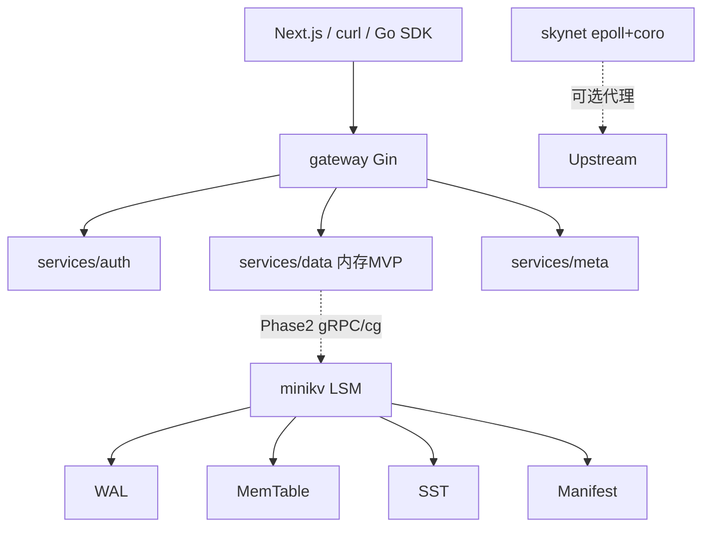

---

## P37. TitanKV 作为 RocksDB 插件？`.so` 加载与 ABI 兼容？

### 1. 满分答案

**本项目不是 RocksDB 插件，也没有以 `.so` 形式挂进 RocksDB。**  
若面试官按「Titan 插件」提问，先纠正定位，再答通用知识：

- Linux 动态库：`dlopen` / `dlsym` / `dlclose`；RocksDB 插件常见 `extern "C"` 导出工厂函数，避免 C++ name mangling（名字修饰）差异  
- **ABI（Application Binary Interface，应用二进制接口）** 风险：编译器版本、`-D_GLIBCXX_USE_CXX11_ABI`、结构体内存布局、虚表、异常跨边界  
- 兼容手段：稳定 C API 边界、同工具链编译、语义化版本、避免在 ABI 面暴露 STL  
- **本仓库做法**：静态/可执行链接 `minikv`，对外 C++ 头文件 API（`DB::open`），不做插件热加载

### 2. 涉及知识点

- 静态链接 vs 动态链接；`extern "C"`；ODR；ABI vs API  
- RocksDB `TableFactory` / 插件扩展点（仅作对比）

### 3. 面试官眼前一亮的点

- 「我知道官方 Titan 是 RocksDB 的 BlobDB 插件；我项目刻意从零写引擎是为了吃透 WAL/Compaction，生产可替换 RocksDB。」  
- 能讲清：**C++ 跨 `.so` 传 `std::string` 为何危险**

### 4. 知识点串联图

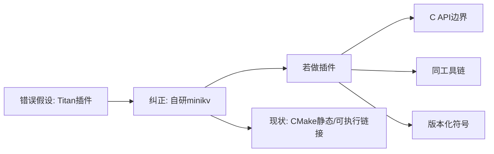

---

## P38. KV 分离写入顺序？原子性？`rename`？

### 1. 满分答案

**本仓库未实现 KV 分离。** 当前写路径（`DBImpl::write`）：编码 WriteBatch →（实现上先写 MemTable 再 WAL，教学简化；工业界应先 WAL）→ 满则 flush 成 SST → Manifest `recordAddFile`。

工业界 Titan/WiscKey 标准答法：

1. 大 Value 超阈值 → 写入 **Blob 文件**（追加），得到 `(blob_file_no, offset, size)`  
2. SST/MemTable 只存 **key + 小索引（BlobIndex）**  
3. **原子性**：Blob 先持久化；索引写入走与普通 KV 相同的 WAL + MemTable；崩溃后「有 Blob 无索引」可被 GC 回收，**不能**「有索引无 Blob」  
4. 文件发布常用 **write temp + `fsync` + `rename(2)`**：POSIX 下同目录 `rename` 替换是原子的，避免读者看到半截文件

本项目 Manifest/SST 的「对新文件可见」也依赖先写完文件再记 Manifest，语义同类。

### 2. 涉及知识点

- WiscKey / TiKV Titan；WAL 与多文件原子性；torn write  
- `rename` 原子性条件（同文件系统）；`fsync` 目录项（部分系统需 `fsync(dirfd)`）

### 3. 面试官眼前一亮的点

- 明确 **crash 一致性不变量**：允许孤儿 Blob，不允许悬空索引  
- 对比本仓库：Value 进 SST，Compaction 会反复搬 Value → 点出引入分离的动机

### 4. 知识点串联图

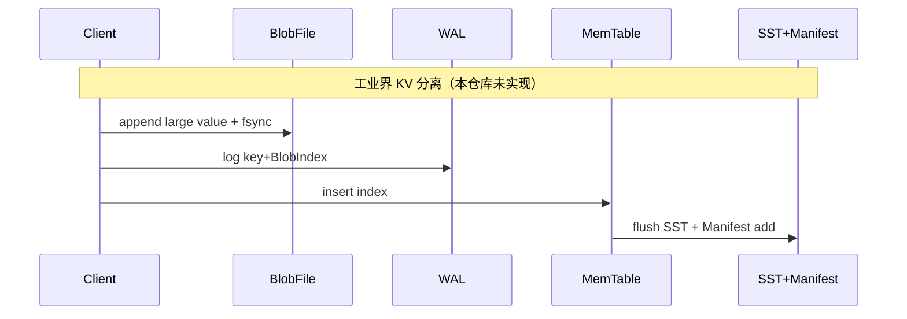

---

## P39. 大 Value 如何少拷贝？`string` / `string_view` / 内存池？

### 1. 满分答案

本仓库相关实践：

- **`Slice`**：非拥有视图（`const char* + size`），热路径传引用，避免 `std::string` 拷贝（见 `slice.h`）  
- **WriteBatch / Status**：`std::move` 转移 `std::string`  
- **SST 读**：块解压后拷到临时 buffer；**无** 自定义 Arena/内存池；SkipList 节点仍 `new`/`delete`  
- **未做**：Blob mmap、`string_view` 贯穿网络、对象池

可讲优化路线：写入用 `string&&` / 完美转发进 batch；读路径 `string_view`/`Slice` 指向 Block Cache；Arena 按 MemTable 生命周期整块释放减碎片。

### 2. 涉及知识点

- 拥有型 vs 视图型；SSO（小字符串优化）；移动语义；Arena  
- 悬空：`string_view`/`Slice` 不能长过底层 buffer

### 3. 面试官眼前一亮的点

- 用 `Slice` 设计哲学对齐 `string_view`，并承认 **生命周期由调用方保证**  
- 指出 `vector<bool>` / 频繁小 `malloc` 在 MemTable 的碎片问题，引出 Arena

### 4. 知识点串联图

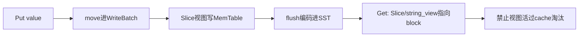

---

## P40. 相对 RocksDB 大 Value QPS？如何测？

### 1. 满分答案

**没有可写进简历的对比数字。** `minikv/docs/benchmark.md` 仍是空表；观测服务里 QPS 是 mock。

诚实答法 + 测量方案：

1. 用仓库已有 `minikv/benches/bench_db.cpp`（或 Google Benchmark）固定场景：value=4KB、batch、sync on/off  
2. `std::chrono::steady_clock` 算吞吐；`perf record/report` 看 `memcpy`/压缩/锁  
3. **不要编造**「比 RocksDB 高 X%」；可说目标是教学正确性，性能基线待填  
4. 若对比 RocksDB：同机、同压缩、同 `fsync` 策略，否则数字无意义

### 2. 涉及知识点

- 微基准 vs 宏基准；`steady_clock` vs `system_clock`；perf / flamegraph  
- sync 写 vs 异步 WAL 对 QPS 数量级影响

### 3. 面试官眼前一亮的点

- 「我拒绝在简历写未实测的提升倍数」——诚信分极高  
- 能列出变量控制表：value size、compression、wal_sync、thread

### 4. 知识点串联图

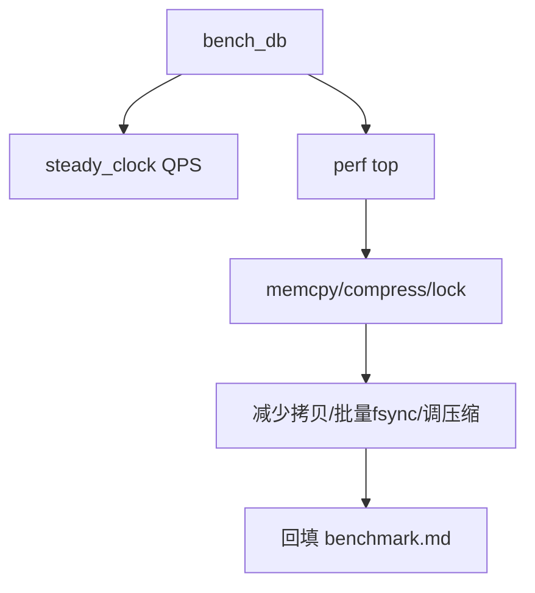

---

## P41. 最难 C++ Bug？ASan / TSan？

### 1. 满分答案（结合真实能力与可讲案例）

推荐讲 **生命周期类**（与源码一致、易复现）：

- **案例**：`Slice` 指向临时 `std::string::c_str()` → 悬空 → 偶发乱数据  
- **定位**：`ENABLE_SANITIZERS=ON`（`cmake/Sanitizers.cmake` → ASan+UBSan）；复现最小单测  
- **修复**：保证 backing store 寿命；或改持有 `string`  
- **Data Race**：MemTable `shared_mutex` 读写；若漏加锁，TSan 打栈；写路径另有 `write_mutex_` 串行化 seq 分配

也可讲 Manifest 尾部撕裂：CRC 失败丢弃而非 abort——「看起来像丢数据，其实是正确容忍」。

### 2. 涉及知识点

- ASan use-after-free；TSan happens-before；UB  
- 视图悬空；锁粒度

### 3. 面试官眼前一亮的点

- 展示 **最小复现 + sanitizer + 根因 + 回归单测** 闭环  
- 区分「功能 bug」与「一致性设计选择」（torn write）

### 4. 知识点串联图


---

## P42. 与 RocksDB 接口兼容？WriteBatch 序列化？如何 Hook？

### 1. 满分答案

**未做 RocksDB API 兼容层。** 自有接口：`minikv::DB` + `WriteBatch`（`include/minikv/`）。

自有 WriteBatch 思路：内存中存 ops 列表；落 WAL 时编码为长度前缀记录（type/key/value），`WAL::replay` 反序列化回放。

若要对齐 RocksDB：

- 实现相似 `DB::Put/Get/Write` 或适配器  
- Hook 写入：包装 `WriteBatch::Handler`、或在 `DBImpl::write` 统一入口打点——**本仓库统一入口已在 `DBImpl::write`**，便于以后加审计/限流

### 2. 涉及知识点

- 适配器模式；WAL 记录格式；批处理原子性（单 batch 多 op 共用一段 WAL）

### 3. 面试官眼前一亮的点

- 「兼容 RocksDB」与「从零实现」是矛盾目标，我选后者并保留窄 API，便于将来换引擎  
- 指出 minikv 写路径已是单锁串行化的简化 Group Commit 雏形

### 4. 知识点串联图

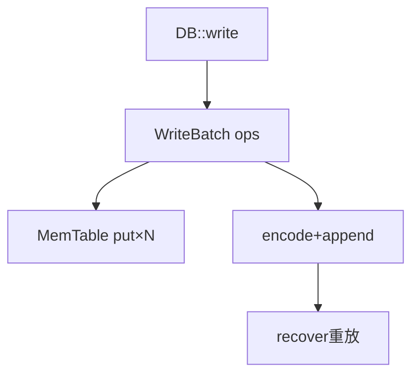

---

## P43. Blob GC？`FALLOC_FL_PUNCH_HOLE`？

### 1. 满分答案

**无 Blob，无 Blob GC。**  

工业界答法：引用计数 / 重写存活 Blob → 新文件 → 改索引 → 删旧文件；或 `fallocate(..., FALLOC_FL_PUNCH_HOLE)` 打洞回收稀疏空洞（需文件系统支持，注意碎片与读性能）。  
本项目「空间回收」靠 **Compaction 丢掉过期 seq/墓碑**（完整合并仍待补全）。

### 2. 涉及知识点

- 垃圾回收 vs LSM Compaction；稀疏文件；空洞与顺序读劣化

### 3. 面试官眼前一亮的点

- 诚实说未做，立刻补上 **与 Compaction 的对比**：分离后 GC 是第二套空间回收，复杂度是引入分离的主成本

### 4. 知识点串联图

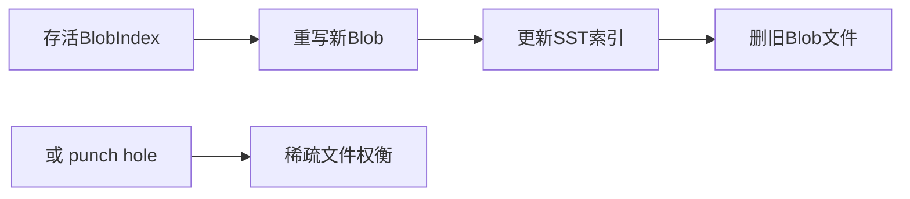

---

## P44. 读写路径用了哪些锁？`shared_mutex`？

### 1. 满分答案

| 锁 | 位置 | 作用 |
|----|------|------|
| `std::mutex write_mutex_` | `DBImpl` | 串行化写：分配 `seq_` + 写 MemTable/WAL |
| `std::shared_mutex` | `MemTable` / `SkipList` | 多读者共享，写者独占 |
| Manifest 内部 `mutex_` | `Manifest` | 保护 levels 元数据追加 |

读路径：`shared_lock` 查 MemTable → Immutable → Version 中 SST（SST 不可变，读文件无需写锁）。  
**不是** RocksDB 那套复杂 `InstrumentedMutex`；这是教学简化。

### 2. 涉及知识点

- 读写锁；写饥饿；临界区最小化  
- 不可变 SST → 无锁读文件

### 3. 面试官眼前一亮的点

- 「写锁在 DB 层串行，读锁在表内共享」——层次清晰  
- 承认写吞吐受单 `write_mutex_` 限制，生产应 Group Commit / 多 MemTable

### 4. 知识点串联图

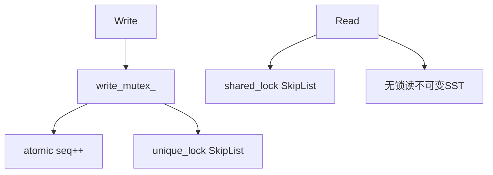

---

## P45. `bad_alloc`？磁盘满 `ENOSPC`？

### 1. 满分答案

- **内存**：`new` 失败抛 `std::bad_alloc`（若未 `nothrow`）。引擎应：捕获后返回 `Status::IOError`/`Busy`，拒绝新写，保留读；避免在析构路径再分配  
- **磁盘**：`write`/`pwrite` 返回 -1 且 `errno==ENOSPC` → 向上变 `Status`，停止 flush/compaction 写新文件，触发告警；**不能**假装 Ok  
- 本仓库 `Status` 惯用法优于异常控制流；应用层（Go 网关）应映射 507/503

### 2. 涉及知识点

- 异常安全基本保证；错误码 vs 异常；背压

### 3. 面试官眼前一亮的点

- 「存储引擎热路径少用异常，用 Status」与课程 Module 02 一致  
- 区分瞬时 Busy 与永久 ENOSPC 的运维动作（扩容 vs 重试）

### 4. 知识点串联图

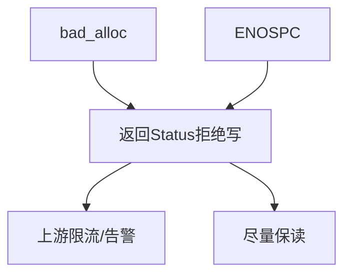

---

## P46. 单测框架？如何 Mock？

### 1. 满分答案

- C++：**GoogleTest**（FetchContent），不是 Catch2  
- 位置：`minikv/tests/*`、`skynet/tests/*`、`tests/course/*`（手撕题）  
- Mock：当前偏 **真实小文件/临时目录** 测 WAL/Manifest，而非 gMock RocksDB——因为没有 RocksDB  
- 测 KV 分离（若实现）：抽象 `BlobStore` 接口，GoogleMock 注入；测 GC 不碰真实磁盘

### 2. 涉及知识点

- 测试金字塔；依赖注入；临时目录 RAII

### 3. 面试官眼前一亮的点

- 强调 Manifest **截断最后一字节** 仍能 open（torn write 单测）——项目特色  
- course 手撕与引擎测分离，面试可现场跑

### 4. 知识点串联图

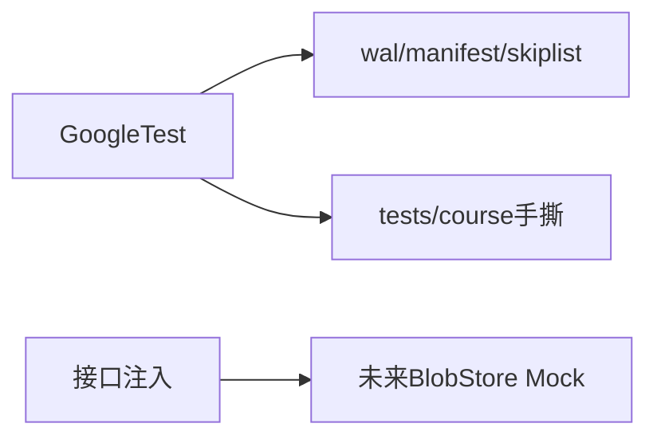

---

## P47. Latency Spike：perf 还是 pprof？Compaction vs GC？

### 1. 满分答案

- C++ 进程用 **`perf`**（或 `perf record` + flamegraph）；Go 服务用 **pprof**  
- 本仓库无 Blob GC，毛刺候选：  
  - **前台**：`write_mutex_` 阻塞、`wal_sync` fsync、MemTable flush 同步路径  
  - **后台**：Compaction 线程（即便 stub 也可能抢 IO）、压缩 Snappy/Zstd、页缓存淘汰  
- 方法：Spike 时 `perf top`；对照日志时间线 flush/compaction；`iostat` 看磁盘；关闭 sync 对比

### 2. 涉及知识点

- 尾延迟；fsync 尾部；优先级调度 / rate limiter（RocksDB 有，本仓库弱）

### 3. 面试官眼前一亮的点

- 「先分语言栈再选工具」  
- 提出加 **Histogram 埋点**（flush 耗时、wal sync 耗时）比盲目 perf 更稳

### 4. 知识点串联图

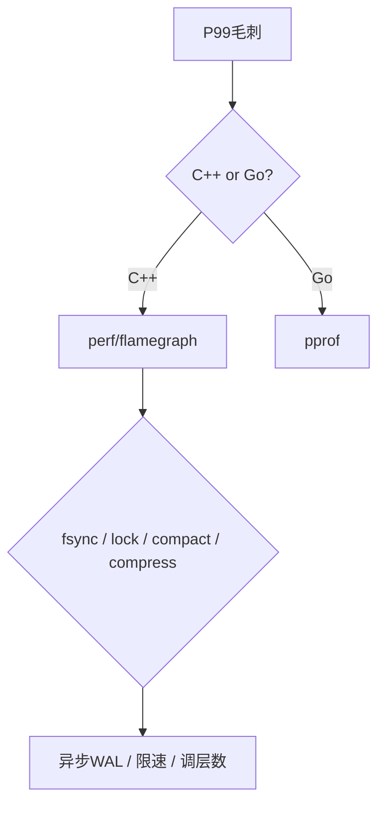

---

## P48. 对比 WiscKey：mmap 读 Blob？本项目呢？

### 1. 满分答案

- WiscKey：Key 在 LSM，Value 在 vLog/Blob；可用 **mmap** 随机读 Value  
- **本项目**：无 Blob；SST 走 `pread`/解压进 buffer（非 mmap 主路径）  
- mmap 优：少一次用户态拷贝、实现简单  
- mmap 劣：大映射吃 **Page Cache / 地址空间**；**Major Page Fault** 延迟不可控；错误处理难（SIGBUS）；多线程与映射生命周期复杂  

选型：延迟敏感点查可用 `pread` + Block Cache；冷大 Value 可 mmap 或直接 IO。

### 2. 涉及知识点

- Page Cache；Major/Minor Fault；`mlock` 可选钉住热页

### 3. 面试官眼前一亮的点

- 能辩证 mmap，不迷信零拷贝  
- 联系本项目 Bloom：先过滤再 IO，比纠结 mmap 更重要

### 4. 知识点串联图

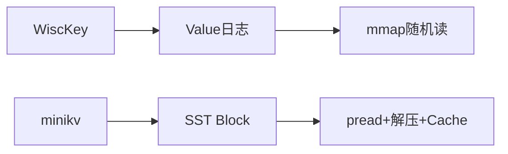

---

## P49. 第三方库？为何不用 Boost？

### 1. 满分答案

C++ 实际依赖：

| 库 | 用途 |
|----|------|
| GoogleTest | 单测 |
| Snappy / Zstd | SST 块压缩 |
| 自研 `log.h` | 日志（无 spdlog） |
| **无** RocksDB / Boost / fmt / gflags / spdlog |

不用 Boost：标准库已覆盖线程/智能指针/文件系统（C++17）；减编译体积与版本地狱。Go 侧用 Gin/JWT 等见 `go.mod`。

### 2. 涉及知识点

- 依赖治理；NIH vs 复用；FetchContent 钉版本

### 3. 面试官眼前一亮的点

- 「日志自己写是为了少依赖，生产可换 spdlog」——有迁移意识  
- 压缩库用 FetchContent，体现可复现构建

### 4. 知识点串联图

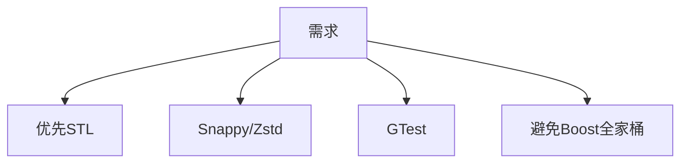

---

## P50. 备份恢复？`std::filesystem` 拷 Blob？

### 1. 满分答案

**无正式 Backup/Restore API。** 现有 `Version::restoreFrom` 只是 **崩溃恢复时从 Manifest 重建 SST 列表**，不是业务备份。

若设计备份：

1. 暂停或用快照 seq，禁用删除旧 SST  
2. `std::filesystem::recursive_directory_iterator` 遍历 `db_path`：CURRENT/MANIFEST/SST/WAL（及未来 Blob）  
3. 拷贝到备份目录；`copy_file`；校验大小/CRC  
4. 恢复：清空目标 → 拷回 → `DB::open` 走正常 recover  

注意：备份中途 Compaction 删文件要用硬链/`link` 或引用计数，避免拷到一半文件消失。

### 2. 涉及知识点

- 一致性快照；硬链接备份；RocksDB BackupEngine 对比

### 3. 面试官眼前一亮的点

- 分清 **crash recovery** 与 **disaster backup**  
- 提出「先硬链再慢慢拷贝」减一致性窗口

### 4. 知识点串联图

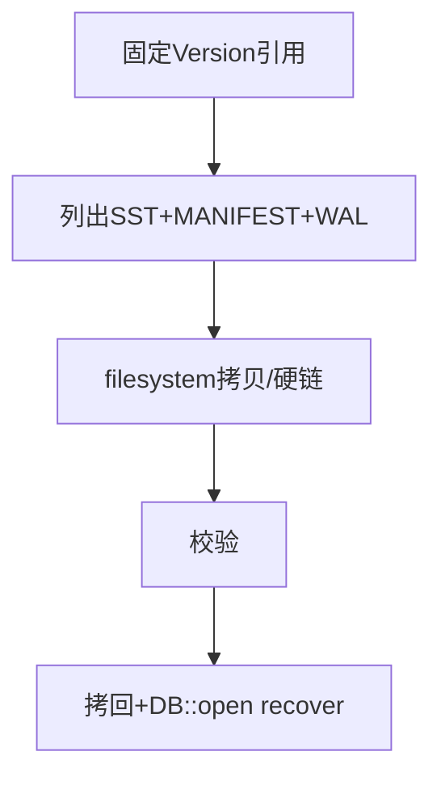

---

## 附加：高频项目追问（同样四段式精简）

### P-Extra A. WAL / MemTable / Manifest 在本项目的分工？

**满分答案**：MemTable = 内存最新写（SkipList）；WAL = 持久化未 flush 写入以便 replay；Manifest = SST 层级元数据账本。恢复顺序：**Manifest → Version → WAL → MemTable**。  
**亮点**：能画顺序并解释为何不能先 WAL 后 Manifest（否则可能指向不存在的 SST）。  
**串联**：`Put → WAL+MemTable → flush SST → Manifest Add → truncate WAL`。

### P-Extra B. 为什么说「不是官方 Titan」？

**满分答案**：官方 Titan 解决 RocksDB 大 Value Compaction 写放大；本仓库品牌重名，实现是教学 LSM，Value 仍在 SST。  
**亮点**：主动避雷，展示调研能力（WiscKey 论文级理解 + 工程边界清晰）。

### P-Extra C. skynet 用 LT 还是 ET？

**满分答案**：`io_context` 注册时带 **`EPOLLET`（边缘触发）**；必须非阻塞 + 读到 EAGAIN。文档若写 LT 以源码为准。  
**亮点**：源码证据意识。

---

## 简历表述建议（防打脸）

**推荐写：**

> 从零实现 C++17 LSM-Tree 教学引擎（WAL/SkipList MemTable/SSTable/Bloom/Manifest/MVCC 编码），配套 C++20 协程网络库与 Go 网关；Compaction 与分布式仍为演进中。

**不要写：**

> RocksDB Titan 插件、KV 分离已完成、QPS 提升 xx%、生产级 Compaction。

---

← 返回主文档：[13-interview.md](./13-interview.md)
