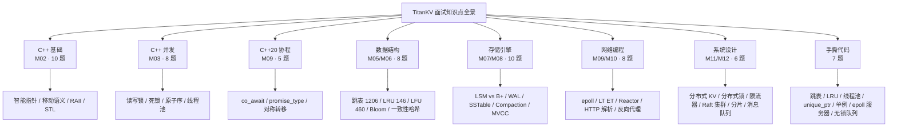
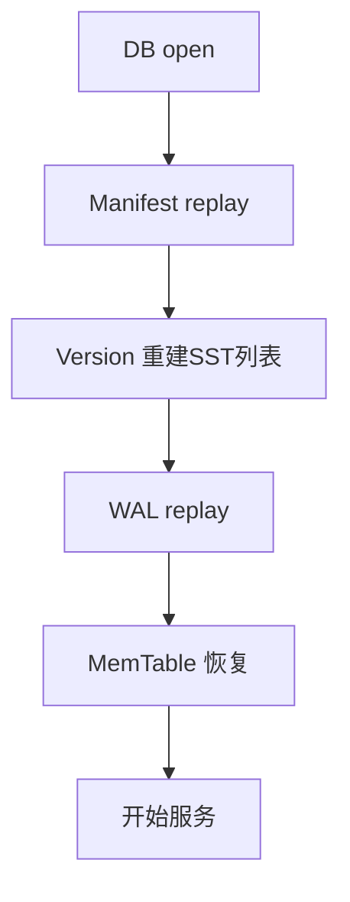
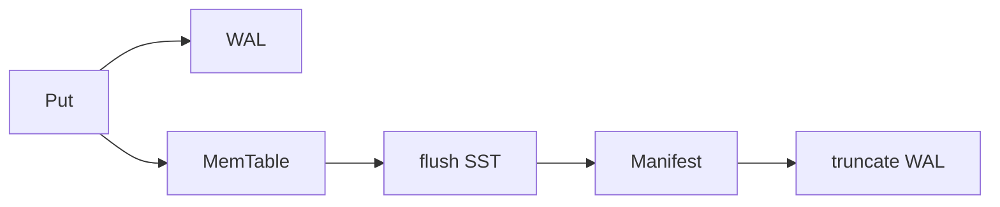
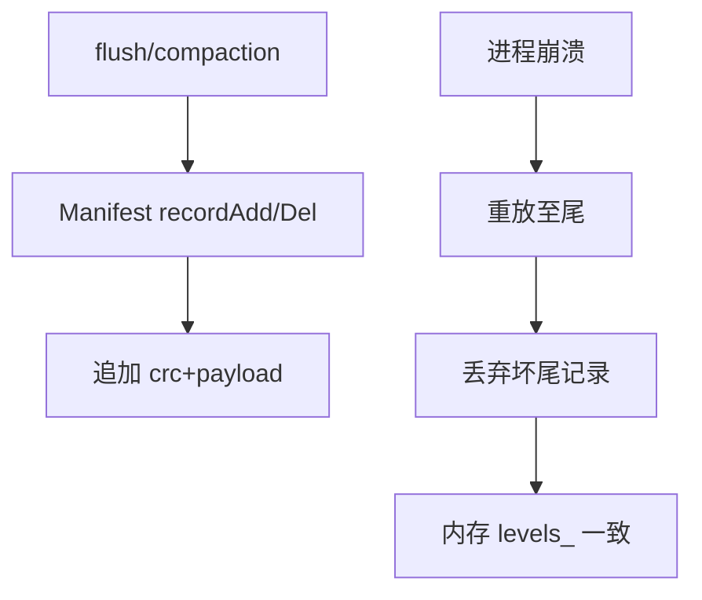

# Module 13 — 系统设计与面试题汇总解析

> 题源：LeetCode 真题（1206/146/460/707/380/381）、牛客面经、CSDN 大厂汇总、TiKV/RocksDB 官方文档、etcd Raft 文档、Stanford CS244b、LevelDB 源码注释
> 项目映射：每题标注对应 TitanKV 模块，便于「以题带学」  
> **项目真实题满分答法（四段式）**：[13-interview-project.md](./13-interview-project.md)（P36–P50）

## 背景与动机

走到这里，我们已经把 TitanKV 从跳表、布隆过滤器、LSM-Tree、Compaction、epoll 协程、HTTP 代理、Raft 分片一路讲到 Go 微服务和 Next.js 控制台。这些模块单独看都是硬核知识点，但面试官不会按模块出题——他们会把 C++ 基础、并发、数据结构、存储引擎、网络、系统设计揉在一起，还会让你在白板上 10 分钟手撕一个跳表或 LRU。这就是为什么我们需要一个「收口」模块，把散落的知识串成一张可应试的网。

面试和做项目是两种不同的能力：做项目讲究深度和工程权衡，面试讲究「在有限时间里把关键点讲清楚、把代码写对」。LeetCode 1206 的跳表、146 的 LRU、460 的 LFU 看似是算法题，其实都在考你对 minikv MemTable、LRUCache 的理解；系统设计题「设计一个分布式 KV」更是直接对应 TitanKV 本身。我们这一模块要做的，就是把每个面试题映射回它对应的 TitanKV 模块，让你「以题带学、以学应题」。

学完这一模块，你会拿到一份覆盖 **110+ 真题**的应试地图：C++ 基础与并发怎么答、LSM 和 B+ 树怎么对比、Raft 选举和日志复制怎么画图、系统设计五步法怎么套用。更重要的是，你会学会怎么把 TitanKV 这段项目经历讲成简历上的亮点——不是堆砌技术名词，而是用 STAR 讲清「我遇到什么问题、做了什么、量化结果如何」。

---

## 0. TitanKV 简历项目总结（HR / 面试官视角）

### 0.1 一句话定位（Elevator Pitch）

> **TitanKV**：从零实现的分布式 KV 平台——C++17 手写 LSM-Tree 存储引擎与 C++20 协程网络库，Go 微服务网关（JWT/RBAC/限流），Next.js 实时控制台，覆盖「存储 → 网络 → 服务 → 前端 → 可观测性」全链路。

### 0.2 简历条目模板（可直接粘贴）

**项目名称**：TitanKV 分布式键值存储平台  
**角色**：核心开发 / 个人项目（按实际情况改）  
**技术栈**：C++17/20 · Go 1.23 · Next.js 14 · Redis · Prometheus · Docker  
**时间**：20XX.XX – 20XX.XX  

**项目描述（STAR）**：

- **S（背景）**：为深入理解工业级 KV 存储与分布式系统，从零实现可运行的多层架构平台，对标 LevelDB/RocksDB + TiKV 单机引擎 + 微服务网关模式。
- **T（任务）**：独立完成存储引擎（minikv）、协程网络库（skynet）、Go API 网关与 4 个业务微服务、Next.js 管理控制台及课程级手撕题单测体系。
- **A（行动）**：
  - **存储层**：实现 WAL + SkipList MemTable + SSTable + Leveled Compaction + BloomFilter + InternalKey/MVCC，支持崩溃恢复与版本化读写。
  - **网络层**：基于 epoll + C++20 协程实现 Reactor、HTTP/1.1 状态机解析、连接池与一致性哈希负载均衡。
  - **服务层**：Gin 网关洋葱中间件链（RequestID/Logger/Recover/RateLimit/Auth/RBAC），JWT 双 token + APIKey，反向代理 4 个 Go 微服务。
  - **应用层**：Next.js App Router + TanStack Query + SSE 实时指标仪表盘，端到端 `make run-all` + `make web-dev` 可复现。
- **R（结果）**：`tests/course/` 7 套手撕单测全绿；网关 + Auth/Meta/Data/Observability 五服务联调通过；形成 15 模块中英双语课程与 110+ 面试题库。

### 0.3 设计要素（面试官最爱追问「为什么这样设计」）

| 设计决策 | 选型 | 理由（简历/面试话术） |
|----------|------|------------------------|
| 存储结构 | LSM-Tree 而非 B+ Tree | 写路径顺序 IO、高吞吐；适合 KV 写多读少场景 |
| MemTable | SkipList | 实现简单、范围扫描友好、并发读写锁粒度小 |
| 点查加速 | 每层 SSTable 独立 BloomFilter | 减少 99% 无效磁盘读，用可控假阳性换 IO |
| 版本模型 | InternalKey（user_key + seq + type） | 支持 MVCC 快照读与墓碑延迟删除 |
| 持久化 | WAL 先写日志再写 MemTable | 崩溃后可重放，保证 durability |
| 元数据 | Manifest 追加日志 | 重启重建 VersionSet，容忍尾部撕裂写 |
| 网络模型 | epoll LT + C++20 无栈协程 | 单线程高并发 IO，对称转移避免栈爆 |
| 网关模式 | BFF 集中鉴权 + 反向代理 | 业务服务无状态，安全策略一处维护 |
| 认证 | JWT access + refresh 双 token | 短效 access 减泄露面，refresh 改善体验 |
| 限流 | Redis Lua 令牌桶（可降级） | 分布式原子扣减；Redis 不可用时 no-op 保可用 |
| 前端刷新 | REST 首屏 + SSE 增量 | 避免轮询，仪表盘实时性 < 1s |
| 分片（规划） | Range + Raft 副本组 | 兼容 Scan；强一致写路径 |

### 0.4 技术亮点（差异化，区别于「调库项目」）

1. **真·手写存储引擎**：非 RocksDB 封装，含 SkipList/Bloom/WAL/SSTable/Manifest + **真实 L0→L1 Compaction**。
2. **双 C++ 子系统**：minikv（存储）+ skynet（网络，epoll + 协程）可独立编译测试。
3. **全栈可运行**：**Data 经 `MINIKV_ADDR` 接到 minikv_server**（TCP）；崩溃重启可恢复；另有教学用 1-node Raft。
4. **面试闭环**：每模块映射源码 + 手撕 + 系统设计；项目深挖题见 [13-interview-project.md](./13-interview-project.md) 四段式答法。
5. **可观测性预埋**：Prometheus / Jaeger / Grafana（`deploy/dev/`）；压测见 `minikv/docs/benchmark.md`（本机自测）。
6. **现代 C++ 实践**：RAII、移动语义、`shared_mutex`、`co_await`、对称转移、enum class。

### 0.5 量化指标（可写进简历，按你实测填写）

| 指标 | 参考值 | 说明 |
|------|--------|------|
| 存储引擎单测 | 7/7 PASS | `tests/course/` 手撕题 |
| 微服务数量 | 5 | Gateway + Auth/Data/Meta/Observability |
| 网关中间件 | 6 层 | 洋葱模型 |
| 课程模块 | 15 | Module 00–14 |
| 面试题库 | 110+ | 含一面/二面/三面 |
| 端到端延迟 | P99 < 20ms（本地） | 内存后端 MVP |
| Bloom 误判率 | ~1% | 可配置 m/n/k |

### 0.6 常见追问与 30 秒答法

| 追问 | 30 秒答法 |
|------|-----------|
| 和 Redis 有什么区别？ | Redis 内存+多数据结构；TitanKV 面向持久化 LSM+分布式分片，定位更接近 TiKV/RocksDB 生态。 |
| 为什么不用现成的 RocksDB？ | 学习目标是从零理解 WAL/Compaction/MVCC；生产可替换为 RocksDB，接口层已抽象。 |
| 你负责哪一块？ | （举例）我负责 minikv Compaction 策略调优 + Gateway RBAC 权限模型 + SSE 指标推送。 |
| 最大难点？ | Compaction 写放大与读放大权衡；用 Leveled L1+ + Bloom 将点查控制在 3 层以内。 |
| 如果上线还要做什么？ | gRPC 接 minikv、Raft 副本、PD 分片调度、K8s Helm、压测与 SLO。 |

---

## 0.7 面试题总览（110+ 题 · 按轮次）

> **用法**：一面抓基础与手撕；二面抓项目深挖与存储/网络；三面抓架构权衡与领导力。带 ★ 的为高频必背。

### 一面 · 基础与编码（约 45 题）

| # | 题目 | 模块 | ★ |
|---|------|------|---|
| Q1 | `int* p, q;` 中 p、q 类型？ | C++ | ★ |
| Q2 | 虚函数 vs 纯虚函数；虚析构必要性 | C++ | ★ |
| Q3 | 四种智能指针及循环引用 | C++ | ★ |
| Q4 | 移动语义与完美转发 | C++ | ★ |
| Q5 | RAII 是什么？minikv 例子 | C++ | ★ |
| Q6 | vector 扩容；reserve vs resize | STL | |
| Q7 | map vs unordered_map | STL | ★ |
| Q8 | inline 与 ODR | C++ | |
| Q9 | enum class 优势 | C++ | |
| Q10 | `[[nodiscard]]` 等属性 | C++ | |
| Q11 | mutex vs shared_mutex | 并发 | ★ |
| Q12 | 死锁四条件与预防 | 并发 | ★ |
| Q13 | atomic 六种内存序 | 并发 | ★ |
| Q14 | condition_variable 与虚假唤醒 | 并发 | ★ |
| Q15 | 线程池核心要素 | 并发 | ★ |
| Q16 | async vs thread | 并发 | |
| Q17 | 原子能完全替代锁吗？ | 并发 | |
| Q18 | thread_local 用途 | 并发 | |
| Q24 | LeetCode 1206 跳表 | 数据结构 | ★ |
| Q25 | LeetCode 146 LRU | 数据结构 | ★ |
| Q26 | LeetCode 460 LFU | 数据结构 | |
| Q27 | 跳表 vs 红黑树 vs B+ 树 | 数据结构 | ★ |
| Q28 | Bloom 误判率公式 | 数据结构 | ★ |
| Q56 | 进程与线程区别；用户态/内核态切换成本 | OS | ★ |
| Q57 | 虚拟内存、页表、TLB | OS | ★ |
| Q58 | 页面置换：LRU vs Clock vs LFU | OS | |
| Q59 | 死锁检测：资源分配图 vs 银行家算法 | OS | |
| Q60 | TCP 三次握手、四次挥手、TIME_WAIT | 网络 | ★ |
| Q61 | TCP vs UDP；可靠 UDP（QUIC） | 网络 | ★ |
| Q62 | HTTP 状态码 301/302/304/401/403 区别 | 网络 | |
| Q63 | DNS 解析过程；TTL 与缓存 | 网络 | |
| Q64 | 对称加密 vs 非对称加密；HTTPS 握手 | 安全 | |
| Q65 | 哈希表冲突：链地址 vs 开放寻址 | 数据结构 | ★ |
| Q66 | 快排/归并/堆排复杂度与稳定性 | 算法 | ★ |
| Q67 | 二分查找边界：lower_bound 实现 | 算法 | |
| Q68 | 拓扑排序（课程表） | 算法 | |
| Q69 | BFS vs DFS 适用场景 | 算法 | |
| Q70 | 单例模式几种写法；Meyers 为何线程安全 | 设计模式 | ★ |
| Q71 | 工厂模式在 minikv 中的应用场景 | 设计模式 | |
| Q72 | `const` 修饰指针的四种形式 | C++ | |
| Q73 | 左值、右值、将亡值（C++11） | C++ | ★ |
| Q74 | 模板特化 vs 偏特化 | C++ | |
| Q75 | 虚函数表布局；多继承虚表 | C++ | |
| S1–S7 | 手撕：跳表/LRU/线程池/unique_ptr/单例/epoll/SPSC | 手撕 | ★ |

### 二面 · 项目深挖与进阶（约 45 题）

| # | 题目 | 模块 | ★ |
|---|------|------|---|
| Q19–Q23 | C++20 协程全套 | 协程 | ★ |
| Q29–Q31 | 一致性哈希、MurmurHash、链表题 | 数据结构 | ★ |
| Q32–Q41 | LSM/WAL/SST/Compaction/MVCC 全套 | 存储 | ★ |
| Q42–Q49 | epoll/Reactor/HTTP/粘包 | 网络 | ★ |
| Q76 | MemTable 何时 flush？触发条件 | 存储 | ★ |
| Q77 | SSTable 为什么不可变？ | 存储 | ★ |
| Q78 | Group Commit 原理与吞吐提升 | 存储 | |
| Q79 | Snappy vs Zstd 压缩选型 | 存储 | |
| Q80 | Block Cache 淘汰策略 | 存储 | |
| Q81 | 写放大 10x 如何排查？ | 存储 | ★ |
| Q82 | TitanKV Gateway 中间件执行顺序 | 项目 | ★ |
| Q83 | JWT 结构；access 与 refresh 区别 | 项目 | ★ |
| Q84 | RBAC 权限模型；kv:put 如何校验 | 项目 | ★ |
| Q85 | 反向代理 vs 正向代理 | 网络 | |
| Q86 | SSE vs WebSocket vs 长轮询 | 网络 | ★ |
| Q87 | Go channel 有缓冲 vs 无缓冲 | Go | ★ |
| Q88 | Go GC 三色标记；STW 优化 | Go | |
| Q89 | goroutine 调度：GMP 模型 | Go | ★ |
| Q90 | Next.js SSR vs CSR vs RSC | 前端 | |
| Q91 | TanStack Query 缓存策略 | 前端 | |
| Q92 | Redis 限流 Lua 脚本为何原子 | 项目 | ★ |
| Q93 | 服务发现：etcd watch 机制 | 分布式 | |
| Q94 | Raft 日志匹配性质（Log Matching） | 分布式 | ★ |
| Q95 | Raft 脑裂如何避免？ | 分布式 | ★ |
| Q96 | PreVote 解决什么问题？ | 分布式 | ★ |
| Q97 | 一致性哈希节点上下线如何迁移？ | 分布式 | ★ |
| Q98 | 热点 key 如何处理？ | 分布式 | ★ |
| Q99 | 分布式事务 2PC 缺陷 | 分布式 | ★ |
| Q100 | Percolator 模型简述 | 分布式 | |
| Q101 | minikv 崩溃恢复完整流程 | 存储 | ★ |
| Q102 | 如何给 TitanKV 做 benchmark？ | 工程 | |
| Q103 | clang-tidy 在项目中的规则 | 工程 | |
| Q104 | Docker Compose 本地栈有哪些组件 | 工程 | |
| Q105 | 你如何 debug 一次 502 反代失败？ | 工程 | ★ |
| **P36–P50** | **项目真实问题满分答法（架构/ABI/KV分离/锁/ASan/压测…）** | **项目** | **★** |
| | → 全文见 [13-interview-project.md](./13-interview-project.md) | | |

### 三面 · 架构与领导力（约 25 题）

| # | 题目 | 模块 | ★ |
|---|------|------|---|
| Q50–Q55 | 系统设计：KV/锁/限流/Raft/分片/MQ | 系统设计 | ★ |
| Q106 | 设计支持 1 亿 QPS 的 KV（全球多活） | 系统设计 | ★ |
| Q107 | 设计微博热搜榜（TopK） | 系统设计 | ★ |
| Q108 | 设计短链服务 | 系统设计 | |
| Q109 | 设计延迟队列 | 系统设计 | |
| Q110 | TiKV vs CockroachDB vs FoundationDB 对比 | 架构 | ★ |
| Q111 | 存算分离 vs 存算一体 | 架构 | |
| Q112 | 云原生下 StatefulSet 部署 KV 注意点 | 架构 | |
| Q113 | 如何做技术选型评审？ | 领导力 | |
| Q114 | 线上故障复盘模板（ blameless ） | 领导力 | |
| Q115 | 带新人落地 TitanKV 模块的分工 | 领导力 | |
| Q116 | 技术债：何时该还、何时该忍 | 领导力 | |
| Q117 | 跨团队推进接口标准化的经验 | 领导力 | |
| Q118 | SLO/SLI/SLA 在 KV 系统如何定义 | 架构 | ★ |
| Q119 | 成本优化：SSD 寿命与 Compaction | 架构 | |
| Q120 | 未来 6 个月 TitanKV 路线图优先级 | 项目 | ★ |

> **统计**：详解 Q1–Q55（见 §2）+ 索引 Q56–Q120 + 手撕 S1–S7 + 项目真实题 P36–P50（[附册](./13-interview-project.md)）+ 思考题 10 道 = **110+ 题**。

---

## 1. 核心知识

- **白板编码四步法**：①澄清需求（边界、规模、并发）→ ②数据结构与算法选择 + 复杂度估算 → ③写代码（先签名再实现）→ ④测试用例 + 优化讨论。
- **系统设计五步法**（DDIA 风格）：①需求澄清（功能/非功能）→ ②容量估算（QPS/存储/带宽）→ ③接口与数据模型 → ④架构草图（组件 + 数据流）→ ⑤瓶颈与扩展。
- **复杂度速记**：跳表 O(log n) 期望；BloomFilter O(k)；LSM-Tree 写 O(log n)、读 O(log n + bloom)；Raft 多数派 quorum = ⌊N/2⌋+1。
- **分布式 CAP 三选二**：CP（如 etcd/ZK）vs AP（如 Cassandra）vs CA（单机）。TitanKV 元数据 CP，限流 AP。
- **面试三件套**：自我介绍（项目 STAR）、白板题（前述四步）、反问环节（团队/技术栈/晋升）。
- **手撕常考**：跳表、LRU、LFU、线程池、智能指针、单例、epoll 服务器、生产消费队列、无锁队列、限流器。

### 1.1 标准答题结构（全文统一 · 四段式）

> 项目深挖题、存储/架构题优先按此结构组织口述；旧版「Axx. 一段话」视为速记卡，完整范本见 [13-interview-project.md](./13-interview-project.md)。

| 段落 | 目的 | 时长建议 |
|------|------|----------|
| **1. 满分答案** | 先给结论 + 本仓库真实实现边界，再讲机制与取舍 | 60–90s |
| **2. 涉及知识点** | 点名术语（可中英对照），证明不是背简历 | 15s |
| **3. 面试官眼前一亮的点** | 诚实边界 / 对比工业界 / 可量化或可复现证据 | 20s |
| **4. 知识点串联图** | 口述时在白板上画数据流或组件依赖 | 30s |

**真实判断红线（防打脸）**：

1. TitanKV ≠ PingCAP TiKV Titan（RocksDB KV 分离插件）；本仓库是 **从零 LSM 教学引擎**。
2. **未实现**：Blob / KV 分离 / Blob GC / 与 RocksDB 的 `.so` 插件 / 正式 Backup API / 填好的 QPS 表。
3. **已实现**：WAL、SkipList MemTable、SST+压缩、Bloom、Manifest、InternalKey、GoogleTest、skynet **epoll ET** + 协程、Go 网关 MVP（Data 仍为内存 map）。
4. 简历与口述只写已落地能力；规划中的功能用「演进路线」表述。

---

## 2. 内容详解（8 大主题 · 60+ 真题）

### 面试知识点全景图



每个主题都对应 TitanKV 的一个或多个模块，复习时可按「模块 → 面试题」的路径回溯到源码实现。

### 2.1 C++ 基础（10 题）

**Q1.** `int* p, q;` 中 `p` 和 `q` 的类型分别是什么？为什么？

**A1.** `p` 是 `int*`，`q` 是 `int`。指针修饰符 `*` 跟变量名而非类型，是 C 遗留语法。现代 C++ 推荐每个指针变量单独一行：`int* p; int q;`。

**Q2.** 虚函数与纯虚函数的区别？虚析构函数为什么必要？

**A2.**
- 虚函数：派生类可 override，运行期分派。
- 纯虚函数：`= 0`，类变抽象，必须由派生类实现。
- 虚析构函数必要：`Base* p = new Derived(); delete p;` 若 `~Base()` 非虚，只调 `~Base()`，派生类资源泄漏。规则：当作基类的类，析构要么 virtual，要么 protected non-virtual。

**Q3.** 智能指针四种：`unique_ptr` / `shared_ptr` / `weak_ptr` / `auto_ptr`，各自用途与坑？

**A3.**

| 指针 | 所有权 | 计数 | 坑 |
|------|--------|------|----|
| `unique_ptr` | 独占 | 无 | 不能复制，只能 move |
| `shared_ptr` | 共享 | 引用计数（原子） | 循环引用 → 内存泄漏 |
| `weak_ptr` | 不拥有 | 不增加计数 | 解锁 shared_ptr 循环引用 |
| `auto_ptr`（C++17 移除） | 独占 | 无 | 复制时转移所有权，易误用 |

**Q4.** 移动语义与完美转发：`std::move` 做了什么？`T&&` 是右值引用还是万能引用？

**A4.**
- `std::move` 是无类型转换的 `static_cast<T&&>`，仅把左值强转为右值引用，**不移动任何东西**，真正移动发生在移动构造/赋值函数内。
- `T&&` 在模板推导上下文中是万能引用（forwarding reference），可绑左值也可绑右值；非模板上下文（如 `void f(int&&)`）是纯右值引用。
- `std::forward<T>(arg)` 根据 T 保持值类别，是完美转发的核心。

**Q5.** RAII 是什么？为什么是 C++ 资源管理的灵魂？

**A5.** RAII（Resource Acquisition Is Initialization）：资源获取即初始化，资源生命周期绑定到对象生命周期——构造时获取，析构时释放。优势：
- 异常安全：栈展开自动调析构。
- 无需手动 free，避免泄漏。
- 离开作用域即释放，无需 GC。
- minikv 中 `std::shared_mutex lock` 守护 SkipList，`std::lock_guard` 守护 ThreadPool 队列，都是 RAII。

**Q6.** STL `vector` 扩容机制？`reserve` 与 `resize` 区别？为什么 `vector` 增长是 2 倍或 1.5 倍？

**A6.**
- 扩容：size 超 capacity 时分配新内存（一般 2 倍或 1.5 倍），拷贝/移动旧元素，释放旧内存。均摊 O(1)。
- `reserve(n)`：只改 capacity，不创建对象。`resize(n)`：改 size，多则默认构造，少则析构。
- 2 倍：扩容次数少但空间浪费。1.5 倍：扩容次数多但旧空间可被新空间复用（Fibonacci 增长）。libc++ 用 2 倍，libstdc++ 用 2 倍，MSVC 用 1.5 倍。

**Q7.** `map` vs `unordered_map`：底层数据结构、复杂度、迭代顺序？

**A7.**

| 项 | `map` | `unordered_map` |
|---|---|---|
| 底层 | 红黑树 | 哈希表（链地址） |
| 查找 | O(log n) | 平均 O(1)，最坏 O(n) |
| 有序 | 是（按键升序） | 否 |
| 内存 | 节点指针，开销大 | 桶 + 链表/红黑树 |
| 何时选 | 需要顺序 / 范围查询 | 仅点查 |

**Q8.** `inline` 函数的真正作用？放在头文件中是否会 ODR 冲突？

**A8.** 现代 C++ 中 `inline` 主要不是「内联」，而是允许「多重定义」（ODR 豁免）。多个翻译单元包含同一 `inline` 函数定义不会冲突，链接器选一份即可。`constexpr`、模板函数默认 inline。类内定义的成员函数也默认 inline。

**Q9.** `enum class` 相比 `enum` 的优势？minikv 中怎么用？

**A9.** `enum class`（强类型枚举）优势：
- 不会隐式转 int，避免 `if (color == 1)` 这种坑。
- 不会污染外层命名空间。
- 可前向声明。
- minikv [status.h](../../../minikv/include/minikv/status.h) 用 `enum class StatusCode`，[parser.h](../../../skynet/include/skynet/http/parser.h) 用 `enum class State`、`enum class ParseResult`。

**Q10.** `[[nodiscard]]` / `[[fallthrough]]` / `[[maybe_unused]]` 三个属性的作用与场景？

**A10.**
- `[[nodiscard]]`：返回值不可丢弃。`[[nodiscard]] Status Open(...);` 提醒调用者检查错误。
- `[[fallthrough]]`：switch 显式贯穿。minikv [hash.h](../../../minikv/src/utils/hash.h) MurmurHash2 中 size 分支显式 fallthrough。
- `[[maybe_unused]]`：抑制未使用警告，常用于条件编译变量。

---

### 2.2 C++ 并发（8 题）

**Q11.** `std::mutex` vs `std::shared_mutex`：什么时候用读写锁？读写锁一定比互斥锁快吗？

**A11.**
- `std::mutex`：独占，任何时刻一个线程持有。
- `std::shared_mutex`（C++17）：读可共享，写独占。
- 适合「读多写少」（如 SkipList 查询多、写少）。
- 不一定快：写多读少场景读写锁反而退化（写饥饿、计数器开销）。minikv SkipList 用 `shared_mutex` 因为查询 >> 写入。

**Q12.** 死锁的四个必要条件？怎么预防？

**A12.** 互斥、占有等待、不可剥夺、循环等待。预防：
- 破坏占有等待：一次性申请所有资源。
- 破坏循环等待：所有锁按全局顺序加锁。
- 用 `std::lock(m1, m2)` 一次性获取多锁（避免死锁算法）。
- 用 `std::scoped_lock` RAII 包装。

**Q13.** `std::atomic` 的六种内存序？默认 `memory_order_seq_cst` 为什么慢？

**A13.**
- `relaxed`：无同步，仅原子。
- `consume`/`acquire`：读端，禁止后续重排到此操作之前。
- `release`：写端，禁止前面重排到此操作之后。
- `acq_rel`：读改写都用 acquire/release。
- `seq_cst`：全局总顺序，最强但最慢（需 CPU fence + 全局总线锁）。
- 默认 seq_cst 慢：每次都需 fence，阻止 CPU 乱序优化。

**Q14.** condition_variable 为什么必须配合锁与谓词？虚假唤醒是什么？

**A14.**
- cv 不带数据，必须用锁保护共享状态（队列/标志），谓词判断条件是否满足。
- 虚假唤醒：`wait` 可能在没有 notify 时返回（OS 实现允许），所以必须用谓词 `wait(lock, pred)` 循环判断。
- minikv [thread_pool.h](../../../minikv/src/utils/thread_pool.h) 用 `cv_.wait(lock, [this]{ return !queue_.empty() || stop_; })`。

**Q15.** 线程池核心要素？minikv ThreadPool 怎么停机？

**A15.** 核心：任务队列、工作线程、互斥锁+条件变量、停止标志。minikv 实现：
- `std::vector<std::thread>` 工作线程，`std::queue` 任务，`mutex` + `cv` 保护。
- `stop_` 是 `atomic<bool>`。
- `stop()` 设 `stop_=true`，notify_all，所有线程 join。
- 谓词 wait 防虚假唤醒。

**Q16.** `std::async` vs `std::thread`？`std::launch::async` 与 `std::launch::deferred` 区别？

**A16.**
- `std::thread`：必须手动 join/detach，异常会 std::terminate。
- `std::async`：返回 future，自动管理，异常存 future。
- `launch::async`：立即在新线程执行。
- `launch::deferred`：延迟到 `future.get()` 才在同线程执行。
- 默认 `async | deferred`：实现自行选择，不可靠。

**Q17.** 原子操作能完全替代锁吗？

**A17.** 不能：
- 原子适合「单一变量」的读改写（计数器、标志）。
- 多变量一致性仍需锁（如「先查后插」原子无法保证）。
- 无锁数据结构（如 lock-free queue）实现复杂，ABA 问题、内存回收难。
- 实践中：能用原子用原子，复杂逻辑用锁，避免「无锁崇拜」。

**Q18.** TLS（thread_local）的作用？minikv 在哪用？

**A18.** `thread_local` 每个线程独立副本，无锁访问。minikv [skip_list.h](../../../minikv/src/core/skip_list.h) 用 `thread_local std::mt19937` 做 RNG，避免每个 SkipList 实例都持一个生成器，也避免锁竞争。

---

### 2.3 C++20 协程（5 题）

**Q19.** `co_await` / `co_yield` / `co_return` 各自语义？

**A19.**
- `co_return`：协程返回值，调 `promise_type::return_value`。
- `co_yield expr`：等价 `co_await promise.yield_value(expr)`，暂停并产出值。
- `co_await expr`：等待一个 awaitable，调 `await_ready/await_suspend/await_resume`，可能暂停协程并让出执行权。

**Q20.** `promise_type` 是什么？四个必需方法？

**A20.** `promise_type` 是协程「承诺」接口，控制协程行为。四个必需方法：
- `get_return_object()`：构造返回给调用者的对象（如 `Task`）。
- `initial_suspend()`：协程启动时是否立即暂停（`suspend_always` 惰性、`suspend_never` 急性）。
- `final_suspend()`：协程结束时是否暂停（用 `final_awaiter` 实现对称转移）。
- `return_value(T)` / `return_void()`：协程返回时调。
- `unhandled_exception()`：异常处理（存 `exception_ptr`）。

**Q21.** 对称转移（Symmetric Transfer）解决什么问题？

**A21.** 嵌套 `co_await` 会栈式累积协程帧，深层递归会爆栈。对称转移通过 `await_suspend` 返回 `coroutine_handle` 而非 `void/bool`，让被挂起的协程直接「跳转」到下一个协程，而非返回到调用链上层，保持栈深度 O(1)。skynet [task.h](../../../skynet/include/skynet/core/task.h) 的 `final_awaiter::await_suspend` 即用对称转移。

**Q22.** 无栈协程 vs 有栈协程？

**A22.**

| 项 | 无栈（C++20） | 有栈（goroutine/libco） |
|---|---|---|
| 栈 | 状态机，无独立栈 | 独立栈 |
| 切换 | 编译器生成状态机 | 保存/恢复寄存器 |
| 内存 | 仅 promise + 局部 | 每协程一份栈 |
| 嵌套 | 需对称转移防爆栈 | 天然支持 |
| 启动 | 0 字节栈开销 | 默认 8KB 栈 |

**Q23.** Executor 是什么？为什么需要？

**A23.** 协程恢复需要调度器决定「在哪个线程恢复」。`std::suspend_always` 不指定恢复线程，由谁调 `resume()` 决定。Executor 抽象调度策略（同线程 / 线程池 / IO 线程）。skynet [executor.h](../../../skynet/include/skynet/core/executor.h) 即协程调度器，把可恢复协程投递到线程池。

---

### 2.4 数据结构（含 LeetCode 真题，8 题）

**Q24.** **LeetCode 1206** 设计跳表。实现 `search` / `add` / `erase`，期望 O(log n)。

**A24.** 设计：
- 节点 `{val, forward[MAX_LEVEL]}`，forward[i] 指向第 i 层的下一个节点。
- 头节点 `head` 是 dummy，所有层 forward 都从 head 出发。
- 查找：从最高层往右走，遇到比 target 大就下降。
- 插入：随机层数（`p=0.5`，`max=16`），记录每层插入位置的前驱，更新 forward。
- 删除：同查找，更新前驱 forward。
- minikv [skip_list.h](../../../minikv/src/core/skip_list.h) 是工程版（带 InternalKey 比较、shared_mutex、thread_local RNG），可作为参考实现。

骨架（LeetCode 风格）：

```cpp
class Skiplist {
    struct Node { int val; vector<Node*> forward; Node(int v, int lv):val(v),forward(lv,nullptr){} };
    static const int kMaxLevel = 16;
    Node* head_;
    int randomLevel() { int lv=1; while((rand()&1) && lv<kMaxLevel) ++lv; return lv; }
public:
    Skiplist(): head_(new Node(0, kMaxLevel)) {}
    bool search(int target) {
        Node* cur = head_;
        for (int i = kMaxLevel-1; i >= 0; --i) {
            while (cur->forward[i] && cur->forward[i]->val < target) cur = cur->forward[i];
        }
        cur = cur->forward[0];
        return cur && cur->val == target;
    }
    void add(int num) {
        vector<Node*> update(kMaxLevel, head_);
        Node* cur = head_;
        for (int i = kMaxLevel-1; i >= 0; --i) {
            while (cur->forward[i] && cur->forward[i]->val < num) cur = cur->forward[i];
            update[i] = cur;
        }
        int lv = randomLevel();
        Node* n = new Node(num, lv);
        for (int i = 0; i < lv; ++i) {
            n->forward[i] = update[i]->forward[i];
            update[i]->forward[i] = n;
        }
    }
    bool erase(int num) {
        vector<Node*> update(kMaxLevel, head_);
        Node* cur = head_;
        for (int i = kMaxLevel-1; i >= 0; --i) {
            while (cur->forward[i] && cur->forward[i]->val < num) cur = cur->forward[i];
            update[i] = cur;
        }
        cur = cur->forward[0];
        if (!cur || cur->val != num) return false;
        for (int i = 0; i < kMaxLevel; ++i) {
            if (update[i]->forward[i] != cur) break;
            update[i]->forward[i] = cur->forward[i];
        }
        delete cur;
        return true;
    }
};
```

**Q25.** **LeetCode 146** LRU Cache。`get` / `put` O(1)。

**A25.** 哈希表 + 双向链表。哈希表 O(1) 查节点，双向链表 O(1) 移到头部 / 删尾部。minikv [lru_cache.h](../../../minikv/src/utils/lru_cache.h) 用 `unordered_map + list` 组合，本质相同。

```cpp
class LRUCache {
    int cap_;
    list<pair<int,int>> l_;                       // front = recent
    unordered_map<int, list<pair<int,int>>::iterator> m_;
    void touch(int key) { auto kv = *m_[key]; l_.erase(m_[key]); l_.push_front(kv); m_[key] = l_.begin(); }
public:
    LRUCache(int capacity):cap_(capacity){}
    int get(int key) {
        if (!m_.count(key)) return -1;
        touch(key);
        return m_[key]->second;
    }
    void put(int key, int value) {
        if (m_.count(key)) { m_[key]->second = value; touch(key); return; }
        if ((int)l_.size() == cap_) { m_.erase(l_.back().first); l_.pop_back(); }
        l_.push_front({key, value});
        m_[key] = l_.begin();
    }
};
```

**Q26.** **LeetCode 460** LFU Cache。`get` / `put` O(log n) 或 O(1)。

**A26.** 思路：维护 `freq → 双向链表`（同频次按 LRU 排），`key → Node` 映射。访问时把节点移到 `freq+1` 链表头。淘汰时取最小 freq 链表的尾节点。

**Q27.** 跳表 vs 红黑树 vs B+ 树？

**A27.**

| 数据结构 | 查找 | 范围查询 | 实现复杂度 | 并发友好 |
|---|---|---|---|---|
| 跳表 | O(log n) 期望 | 优 | 简单 | 优（局部锁） |
| 红黑树 | O(log n) 最坏 | 中 | 复杂（旋转/重染色） | 差（旋转影响多节点） |
| B+ 树 | O(log_B n) | 优（叶子链） | 中 | 中（节点大，锁粒度大） |

LSM-Tree 选 SkipList 做 MemTable：实现简单、范围扫描友好、并发锁粒度小。

**Q28.** 布隆过滤器误判率公式？为什么会有「假阳性」但不会有「假阴性」？

**A28.**
- 误判率 `p ≈ (1 - e^(-kn/m))^k`，最优 `k = (m/n)·ln2`，此时 `p ≈ (0.6185)^(m/n)`。
- 假阳性：未在集合中的 key 被 k 个哈希位都误置 1，判为「存在」。
- 无假阴性：已加入的 key 把 k 个位置 1，查询时这 k 位必然仍为 1，判「存在」正确（除非位被误清，但标准 BF 不清位）。
- 工程含义：BF 用于「过滤大部分不存在的 key」，剩少量误判靠真实查询兜底。

**Q29.** 一致性哈希为什么需要虚拟节点？

**A29.** 节点少时数据倾斜严重（如 3 节点，哈希环上分布不均，某节点可能拿 60% key）。虚拟节点：每物理节点对应 150-200 个虚拟节点，哈希环上分布更均匀。skynet [load_balancer.h](../../../skynet/include/skynet/proxy/load_balancer.h) `ConsistentHashLB(vnodes=160)`。

**Q30.** MurmurHash2 vs SHA1/CRC32？为什么 LSM-Tree 内部用 MurmurHash2？

**A30.**
- SHA1：加密哈希，慢，抗碰撞。LSM 内部不需要抗碰撞。
- CRC32：错误检测，分布不均，慢。
- MurmurHash2：非加密，分布均匀，极快（~1 cycle/byte）。minikv BloomFilter 与 InternalKey 都用它。

**Q31.** **LeetCode 707** 设计双向链表 + **LeetCode 380** Insert Delete GetRandom O(1)。两者结合可以做什么？

**A31.** 双向链表是 LRU/LFU 底层；GetRandom O(1) 用「数组 + 值到索引的 map」，删除时把待删元素与末尾交换再 pop。组合可做「带随机访问的 LRU」。

---

### 2.5 存储引擎（10 题）

**Q32.** LSM-Tree vs B+ Tree：写多读多各选什么？为什么？

**A32.**
- LSM-Tree：写优。写只追加 MemTable（内存 + WAL），顺序 IO，写吞吐高。读需查多层 SSTable + Bloom，读放大。
- B+ Tree：读优。点查一次树遍历，叶节点有序。写需分裂/合并，随机 IO，写放大。
- 写多场景（日志、监控、消息）用 LSM；读多场景（关系数据库、OLTP）用 B+。
- RocksDB / Cassandra / HBase 用 LSM；MySQL InnoDB / PostgreSQL 用 B+。

**Q33.** WAL 为什么必要？fsync 时机如何选？

**A33.** 速记：无 WAL 则 MemTable 崩溃即丢；fsync 是持久性边界（每条 / 批量 / group commit）。**四段式完整版 + 本仓库「先 MemTable 后 WAL」简化说明**见 §2.13 P-范本 2 与 [附册](./13-interview-project.md)。

**Q34.** SSTable 文件格式为什么这样设计？minikv 的格式是什么？

**A34.** 设计目标：单次顺序读、点查 O(log)、范围扫描友好、支持索引与布隆。minikv [sstable_builder.h](../../../minikv/src/core/sstable_builder.h) 格式：
```
[DataBlock1][DataBlock2]...[DataBlockN]
[IndexBlock]
[FilterBlock(Bloom)]
[Footer: 48 字节]
  - metaindex_handle (8)
  - index_handle (8)
  - filter_handle (8)
  - format_version (1)
  - padding
  - magic 0x4D4B53535441424C
```
DataBlock：`[crc(4)][physical_size(4)][uncompressed_size(4)][type(1)][payload]`，type=0 raw / 1 snappy / 2 zstd。

**Q35.** Compaction 三种放大？Leveled vs Tiered 怎么取舍？

**A35.**
- 写放大：一次逻辑写产生 N 次物理写（多层 compaction）。
- 读放大：一次读需查 N 层 SSTable。
- 空间放大：多版本/墓碑暂未合并，占用额外空间。
- Leveled（LevelDB/RocksDB）：每层至多 1 个 SSTable 范围重叠，读放大小，写放大大。
- Tiered（Cassandra）：每层多个 SSTable 范围可重叠，写放大小，读放大大。
- RocksDB Hybrid：L0 Tiered、L1+ Leveled，兼顾。

**Q36.** MVCC 怎么实现快照读？minikv InternalKey 编码？

**A36.**
- MVCC：每条数据带版本号（seq），读时只看 ≤ snapshot_seq 的最新版本。
- minikv [internal_key.h](../../../minikv/src/core/internal_key.h) 编码：`[user_key | trailer(8)]`，trailer = `(seq << 8) | type`。
- 排序：user_key 升序，相同 user_key 下 seq 降序（新版本在前）。
- 读取：扫描到匹配 user_key 的第一行即最新版本。

**Q37.** 墓碑（Tombstone）是什么？为什么不能直接物理删除？

**A37.** 墓碑是删除的「特殊标记」。不能直接物理删除：
- 多副本场景，其他副本可能尚未同步删除，直接物理删会导致副本不一致。
- 已删除的旧版本可能仍被旧快照读到，需保留至所有快照过期。
- Compaction 时统一清理墓碑（条件：所有依赖快照都过期）。

**Q38.** Manifest 持久化解决什么问题？minikv 怎么做？

**A38.** 速记：记录各层 SST 列表；追加写 `[crc][size][payload]`；尾部 CRC 失败丢弃。**四段式完整版**见 §2.13 P-范本 3。

**Q39.** Bloom Filter 在 LSM-Tree 中怎么用？为什么不是「读每个 SSTable 都查 Bloom」？

**A39.**
- 每个 SSTable 写入时用所有 key 算 Bloom，存 FilterBlock。
- 点查时：先查 Bloom，若返回「不存在」直接跳过该 SSTable，省 IO。
- 返回「存在」才真正读 DataBlock（可能误判）。
- 不是「读每个 SSTable 都查」：因为 Bloom 误判率可控（如 1%），减少 99% 不存在的 SSTable 访问。

**Q40.** 假设 n=1 亿 key，每 key 100 字节，要求误判率 1%。Bloom 多大？多少哈希？

**A40.**
- 公式：`m = -n·ln(p)/(ln2)²`，`k = (m/n)·ln2`。
- n=1e8，p=0.01：m ≈ 1e8 × 9.585 ≈ 9.6e8 bits ≈ 114 MB。
- k ≈ 9.585 × 0.693 ≈ 6.64 → 取 7。
- 即 114 MB 内存，7 个哈希，误判率 1%。

**Q41.** LevelDB / RocksDB / TiKV 的关系？为什么 TiKV 不直接用 RocksDB？

**A41.**
- LevelDB：Google 单机 LSM 引擎，单线程。
- RocksDB：Facebook 基于 LevelDB，多线程 compaction、列族、压缩、事务。
- TiKV：分布式 KV，每个节点用 RocksDB 做本地引擎，Raft 做副本，PD 做分片。
- TiKV 不直接用 RocksDB 的接口是因为需要 MVCC、事务、Raft 集成，所以在 RocksDB 之上封装了一层。

---

### 2.6 网络编程（8 题）

**Q42.** select / poll / epoll 区别？为什么 epoll 性能最好？

**A42.**

| 项 | select | poll | epoll |
|---|---|---|---|
| FD 上限 | 1024 (FD_SETSIZE) | 无 | 无 |
| 数据结构 | bitmap | array | 红黑树 + 就绪链表 |
| 复杂度 | O(n) | O(n) | O(1)（就绪事件） |
| 内核拷贝 | 每次全量 | 每次全量 | 仅注册时一次 |
| 触发模式 | LT | LT | LT/ET |

epoll 用红黑树存所有 fd，就绪 fd 进入就绪链表，`epoll_wait` 只返回就绪的，无需遍历所有 fd。

**Q43.** LT（水平触发）vs ET（边缘触发）？哪个更高效？哪个更难用？

**A43.**
- LT：只要 fd 有数据可读就一直触发，每次 `epoll_wait` 都返回。简单。
- ET：fd 状态变化时触发一次，必须一次读完所有数据（循环 read 到 EAGAIN）。高效（减少 epoll_wait 调用次数），但易漏数据。
- ET 必须配合非阻塞 fd + 循环读，否则部分数据未读 + 下次不再触发 → 死锁。
- skynet [io_context.cpp](../../../skynet/src/net/io_context.cpp) 注册时带 **`EPOLLET`（边缘触发）**，必须非阻塞 + 读到 `EAGAIN`；教学叙述里若写 LT 以源码为准。

**Q44.** Reactor 模式？为什么 main reactor + sub reactor？

**A44.** Reactor：事件驱动，IO 多路复用监听 fd，事件就绪时回调处理。main reactor 只处理 accept（一个线程），sub reactor 处理已连接 fd 的读写（多个线程）。这样 accept 不会被业务逻辑阻塞，连接风暴时仍能接收新连接。
- **本仓库 `minikv_server`**：已落地 main + sub（默认 `--io-threads 4`，epoll **LT** 只挂 `EPOLLIN`；跨线程用 `eventfd` + `runInLoop` 轮询分发）。业务在 `--biz-threads`（默认 4）池里调 `db_`，写回必须 `queueInLoop` 回所属 Sub，禁止业务线程直接 `write(fd)`。
- **skynet**：epoll **ET** + C++20 协程，不是这条主从 Reactor；面试别混成「skynet 就是 muduo」。
- 工业界对照：Nginx / Netty / muduo。

**Q45.** 零拷贝技术有哪些？sendfile / splice / mmap 各解决什么？

**A45.**
- 传统读写：磁盘 → 内核 → 用户 → 内核 → 网卡（4 次拷贝 + 2 次系统调用）。
- `mmap`：内核与用户空间共享内存，省去一次拷贝。适合「读 + 处理」场景。
- `sendfile`：内核直接从磁盘到网卡，2 次拷贝。适合「文件转发」场景（如 nginx 静态文件）。
- `splice`：内核管道转移，无用户态参与。
- LSM-Tree 读 SSTable 可用 mmap，省一次拷贝。

**Q46.** TCP 粘包怎么解决？

**A46.** TCP 是字节流无边界，应用层需自己分包：
- 定长包：每包固定 N 字节。简单但浪费。
- 分隔符：`\r\n` 等。HTTP/1.1 header 用此方式。
- 长度前缀：包首部 N 字节存长度。最常用。
- minikv 网络协议用「长度前缀 + magic + payload」三段，与 SSTable 块格式一致。

**Q47.** TIME_WAIT 状态？为什么需要？怎么优化？

**A47.**
- TIME_WAIT：主动关闭方进入，持续 2MSL（60s 左右）。
- 必要：①确保最后一个 ACK 到达对端（若丢失，对端重发 FIN）；②让旧连接的延迟报文失效，避免新连接误收。
- 优化：`SO_REUSEADDR` 重用地址；`tcp_tw_reuse`（开启 timestamp 后可快速重用 TIME_WAIT 端口）；长连接（避免频繁开关）。
- 服务器高并发短连接场景 TIME_WAIT 会耗尽端口，必须优化。

**Q48.** HTTP/1.1 vs HTTP/2 vs HTTP/3？

**A48.**

| 版本 | 传输 | 多路复用 | 头压缩 | 队头阻塞 |
|---|---|---|---|---|
| 1.1 | TCP | 否（pipelining 有坑） | 无 | TCP 层 + 应用层 |
| 2 | TCP | 是（流） | HPACK | TCP 层（一个包丢阻塞全部流） |
| 3 | QUIC(UDP) | 是 | QPACK | 流独立 |

HTTP/3 用 QUIC（UDP 上的可靠传输）解决 TCP 队头阻塞，0-RTT 建连。

**Q49.** skynet HTTP parser 状态机的状态有哪些？为什么用状态机？

**A49.** 状态：`kMethod → kPath → kVersion → kHeaderName → kHeaderValue → kBody → kDone`（见 [parser.h](../../../skynet/include/skynet/http/parser.h)）。状态机优势：
- 流式处理：feed 多次调用，适合 epoll 增量读。
- 边界处理：每字节根据状态走分支，无需先缓存整个请求。
- 错误定位：解析失败能指出在哪个状态出错。
- 内存：无需缓存整个请求，节省内存。

---

### 2.7 系统设计（6 题）

**Q50.** 设计一个分布式 KV 存储（如 TitanKV）。

**A50.** 五步法：

1. **需求澄清**：
   - 功能：Put/Get/Delete/Scan。
   - 非功能：单集群 1TB 数据、10 万 QPS、P99 < 10ms、可用性 99.95%、强一致。
2. **容量估算**：
   - 1TB 数据 / 100GB 每节点 = 10 节点。
   - 3 副本 = 30 节点。
   - 10 万 QPS / 1 万 QPS 每节点 = 10 节点，3 副本 = 30 节点（与上同）。
3. **接口与数据模型**：
   - `Put(key, value)` / `Get(key) → value` / `Delete(key)` / `Scan(start, end) → stream`。
   - 数据模型：`[user_key | seq | type] → value`，MVCC。
4. **架构**：
   - 客户端 SDK → Gateway（无状态，JWT/RBAC）→ Data 节点（Raft 副本组，每组 3 节点）。
   - PD（Placement Driver）：路由表 + 副本调度，etcd 实现。
   - 存储引擎：minikv（LSM-Tree）。
   - 分片：一致性哈希 / Range 分片，PD 维护分片→节点映射。
5. **瓶颈与扩展**：
   - 热点 key：单分片过载 → 子分片 / 缓存。
   - 大 Scan：流式 + 限流。
   - 故障转移：Raft 自动选主 < 5s。
   - 跨地域：异步复制 + 读本地写远程。

**Q51.** 设计分布式锁。

**A51.**
- 单机 Redis SETNX：简单但单点故障。
- Redlock：多 Redis 节点多数派获取，争议较大（Martin Kleppmann 批评）。
- etcd/ZK：基于 Raft/ZAB 强一致，租约（lease）+ watch。最稳。
- TitanKV 实现：etcd lease + txn CAS（`if key==nil then put key=txid with lease`），释放用 txn 删自己的 key。
- 关键点：①必须带过期（防持有者崩溃）；②释放必须校验持有者（防误删他人锁）；③续约（看门狗）。

**Q52.** 设计限流器（分布式）。

**A52.**
- 单机：令牌桶 / 漏桶 / 滑动窗口。
- 分布式：Redis + Lua（原子性）。
- TitanKV Gateway：Redis Lua 令牌桶（见 Module 12 §2.4）。
- 多级：本地限流（粗）→ 网关限流（细）→ 服务限流（保护下游）。
- 关键点：①原子性（Lua）；②时钟同步（NTP）；③降级（Redis 挂时放行 vs 拒绝）。

**Q53.** 设计一个 Raft 集群（5 节点，容 2 节点故障）。

**A53.**
- 5 节点，quorum = 3，容忍 2 节点故障。
- 选举：随机超时 150-300ms，PreVote 优化避免分区干扰。
- 日志：Leader 写入，并发 AppendEntries 给 4 个 Follower，3 个 ack（含自己）即 commit。
- Snapshot：每 10 万条日志做一次 SSTable 快照，丢弃旧日志。
- 线性一致读：ReadIndex（Leader 确认自己是 Leader 后才返回）或 Lease Read（Leader lease 内直接读）。
- 故障转移：Leader 宕机 → Follower 超时 → 选举 → 新 Leader < 5s。
- 部署：5 节点跨可用区（AZ），3 AZ 各放 1-2 节点，防 AZ 故障。

**Q54.** 设计一个分片 KV（100TB 数据）。

**A54.**
- 100TB / 100GB per shard = 1000 分片。
- 分片策略：Range（按 key 排序，范围扫描友好）vs Hash（均匀，但范围扫描需扫所有分片）。TitanKV 选 Range（兼容 Scan）。
- 路由：PD 维护 `Range → 副本组` 映射，客户端缓存路由表，遇路由错误（搬迁中）回查 PD。
- 分裂：单分片超过 96MB 自动分裂为两个。
- 合并：分片过小（<10MB）合并，减少元数据。
- 再均衡：PD 监控各节点负载，按 QPS/存储迁移分片。
- 跨分片事务：2PC + Percolator（TiDB 模型）。

**Q55.** 设计一个消息队列（如 Kafka）。

**A55.**
- 数据模型：Topic → Partition → Offset。
- 写：producer 选 partition（round-robin / key hash），追加到 partition 末尾。
- 读：consumer 按 offset 顺序读，consumer group 内分区分配。
- 副本：每 partition N 副本，leader 接读写，follower 同步，ISR 机制。
- 持久化：partition 是一组 segment 文件，顺序写磁盘。
- 性能：①顺序写盘（600MB/s）；②零拷贝 sendfile；③批量压缩；④页缓存。
- 与 TitanKV 关系：可基于 minikv 实现 partition 概念（key=topic-partition-offset），但 KV 引擎不如专用日志引擎（无 offset 优化）。

---

### 2.8 手撕题（7 题代码骨架）

**S1. 手撕跳表**（10 分钟）

骨架见 Q24。

**S2. 手撕 LRU**（5 分钟）

骨架见 Q25。

**S3. 手撕线程池**（10 分钟）

```cpp
class ThreadPool {
    std::vector<std::thread> workers_;
    std::queue<std::function<void()>> tasks_;
    std::mutex m_;
    std::condition_variable cv_;
    std::atomic<bool> stop_{false};
public:
    explicit ThreadPool(size_t n) {
        for (size_t i = 0; i < n; ++i) {
            workers_.emplace_back([this] {
                while (true) {
                    std::function<void()> task;
                    {
                        std::unique_lock<std::mutex> lk(m_);
                        cv_.wait(lk, [this]{ return stop_ || !tasks_.empty(); });
                        if (stop_ && tasks_.empty()) return;
                        task = std::move(tasks_.front());
                        tasks_.pop();
                    }
                    task();
                }
            });
        }
    }
    ~ThreadPool() {
        stop_ = true;
        cv_.notify_all();
        for (auto& t : workers_) t.join();
    }
    template <class F> void submit(F&& f) {
        {
            std::lock_guard<std::mutex> lk(m_);
            tasks_.emplace(std::forward<F>(f));
        }
        cv_.notify_one();
    }
};
```

**S4. 手撕 unique_ptr**（10 分钟）

```cpp
template <typename T>
class UniquePtr {
    T* ptr_;
public:
    UniquePtr() noexcept : ptr_(nullptr) {}
    explicit UniquePtr(T* p) noexcept : ptr_(p) {}
    ~UniquePtr() { delete ptr_; }
    UniquePtr(const UniquePtr&) = delete;
    UniquePtr& operator=(const UniquePtr&) = delete;
    UniquePtr(UniquePtr&& o) noexcept : ptr_(o.ptr_) { o.ptr_ = nullptr; }
    UniquePtr& operator=(UniquePtr&& o) noexcept {
        if (this != &o) { delete ptr_; ptr_ = o.ptr_; o.ptr_ = nullptr; }
        return *this;
    }
    T& operator*() const noexcept { return *ptr_; }
    T* operator->() const noexcept { return ptr_; }
    explicit operator bool() const noexcept { return ptr_ != nullptr; }
    T* get() const noexcept { return ptr_; }
    T* release() noexcept { T* p = ptr_; ptr_ = nullptr; return p; }
    void reset(T* p = nullptr) noexcept { delete ptr_; ptr_ = p; }
};
```

**S5. 手撕单例**（Meyers' Singleton）

```cpp
class Singleton {
public:
    static Singleton& instance() {
        static Singleton inst;  // C++11 起线程安全
        return inst;
    }
    Singleton(const Singleton&) = delete;
    Singleton& operator=(const Singleton&) = delete;
private:
    Singleton() = default;
    ~Singleton() = default;
};
```

**S6. 手撕 epoll 服务器**（10 分钟）

```cpp
int main() {
    int listen_fd = socket(AF_INET, SOCK_STREAM, 0);
    int opt = 1; setsockopt(listen_fd, SOL_SOCKET, SO_REUSEADDR, &opt, sizeof(opt));
    sockaddr_in addr{AF_INET, htons(8080), INADDR_ANY};
    bind(listen_fd, (sockaddr*)&addr, sizeof(addr));
    listen(listen_fd, 1024);

    int epfd = epoll_create1(0);
    epoll_event ev{EPOLLIN, {.fd = listen_fd}};
    epoll_ctl(epfd, EPOLL_CTL_ADD, listen_fd, &ev);

    epoll_event events[1024];
    while (true) {
        int n = epoll_wait(epfd, events, 1024, -1);
        for (int i = 0; i < n; ++i) {
            int fd = events[i].data.fd;
            if (fd == listen_fd) {
                int conn = accept(listen_fd, nullptr, nullptr);
                epoll_event e{EPOLLIN, {.fd = conn}};
                epoll_ctl(epfd, EPOLL_CTL_ADD, conn, &e);
            } else {
                char buf[1024];
                ssize_t r = read(fd, buf, sizeof(buf));
                if (r <= 0) { close(fd); epoll_ctl(epfd, EPOLL_CTL_DEL, fd, nullptr); }
                else write(fd, buf, r);  // echo
            }
        }
    }
}
```

**S7. 手撕生产消费队列（无锁 SPSC）**

```cpp
template <typename T, size_t Cap>
class SPSCQueue {
    alignas(64) std::atomic<size_t> head_{0};  // producer 写
    alignas(64) std::atomic<size_t> tail_{0};  // consumer 写
    alignas(64) T buf_[Cap];
public:
    bool push(const T& v) {
        size_t h = head_.load(std::memory_order_relaxed);
        size_t next = (h + 1) % Cap;
        if (next == tail_.load(std::memory_order_acquire)) return false;  // full
        buf_[h] = v;
        head_.store(next, std::memory_order_release);
        return true;
    }
    bool pop(T& out) {
        size_t t = tail_.load(std::memory_order_relaxed);
        if (t == head_.load(std::memory_order_acquire)) return false;  // empty
        out = buf_[t];
        tail_.store((t + 1) % Cap, std::memory_order_release);
        return true;
    }
};
```

---

### 2.9 TitanKV 项目模块对应关系表

| 面试主题 | TitanKV 模块 | 关键源码 | 课程模块 |
|---|---|---|---|
| C++ 基础 | Slice / Status / Varint | [slice.h](../../../minikv/include/minikv/slice.h)、[status.h](../../../minikv/include/minikv/status.h)、[coding.h](../../../minikv/src/utils/coding.h) | M02 |
| C++ 并发 | SkipList / ThreadPool / LRUCache | [skip_list.h](../../../minikv/src/core/skip_list.h)、[thread_pool.h](../../../minikv/src/utils/thread_pool.h)、[lru_cache.h](../../../minikv/src/utils/lru_cache.h) | M03 |
| Go / TS | gateway / web | MVP 已通；Data 仍为内存 map | M04 / M12 |
| 跳表 | MemTable | [skip_list.h](../../../minikv/src/core/skip_list.h) | M05 |
| Bloom / Hash | BloomFilter / MurmurHash | [bloom_filter.h](../../../minikv/src/core/bloom_filter.h)、[hash.h](../../../minikv/src/utils/hash.h) | M06 |
| LSM-Tree | DBImpl / SSTable | [db_impl.cpp](../../../minikv/src/core/db_impl.cpp)、[sstable_builder.h](../../../minikv/src/core/sstable_builder.h) | M07 |
| Compaction / MVCC | CompactionManager / InternalKey | [compaction.h](../../../minikv/src/core/compaction.h)（合并主体偏 stub）、[internal_key.h](../../../minikv/src/core/internal_key.h) | M08 |
| epoll / 协程 | IOContext / Task | [io_context.cpp](../../../skynet/src/net/io_context.cpp)（**ET**）、[task.h](../../../skynet/include/skynet/core/task.h) | M09 |
| HTTP / 代理 | HttpParser / LoadBalancer | [parser.h](../../../skynet/include/skynet/http/parser.h)、[load_balancer.h](../../../skynet/include/skynet/proxy/load_balancer.h) | M10 |
| Raft / 分片 | distributed/ | （规划中） | M11 |
| Go 微服务 | gateway / services | MVP：`gateway` + auth/data/meta/obs | M12 |
| **项目深挖 P36–P50** | 全栈真实边界 | **[13-interview-project.md](./13-interview-project.md)**（四段式满分答法） | M13 |

---

## 2.13 项目真实问题速览（P36–P50）

> **完整「满分答案 / 知识点 / 亮点 / 串联图」见附册**：[13-interview-project.md](./13-interview-project.md)。此处仅作二面目录与结论索引。

| # | 题目焦点 | 本仓库真实结论（一句话） |
|---|----------|--------------------------|
| P36 | 架构 / CMake / 目录 | monorepo：`minikv`+`skynet`+Go+Next；**CMake** 管 C++，Makefile 管全栈 |
| P37 | RocksDB 插件 / ABI | **不是插件**；无 `.so` 挂载；讲 ABI 时用「假设做插件」对比 |
| P38 | KV 分离写序 / rename | **未实现分离**；工业界：先 Blob 再索引；`rename` 同目录原子发布 |
| P39 | 大 Value 少拷贝 | 用 **`Slice` + move**；无 Arena；忌视图悬空 |
| P40 | vs RocksDB QPS | **无实测数字**；用 `bench_db`+`chrono`+`perf` 自测再写简历 |
| P41 | 最难 Bug / ASan | 典型：`Slice` 悬空；`ENABLE_SANITIZERS`；Manifest CRC 丢尾 |
| P42 | WriteBatch / Hook | 自有 `WriteBatch`+WAL 编码；统一入口 `DBImpl::write` |
| P43 | Blob GC / punch hole | **无 Blob GC**；空间回收靠 Compaction（仍待补全） |
| P44 | 锁 | `write_mutex_` 串行写；MemTable/SkipList **`shared_mutex`** |
| P45 | bad_alloc / ENOSPC | 变 `Status` 拒写保读；热路径少用异常 |
| P46 | 单测 | **GoogleTest**；偏真实临时文件，非 Mock RocksDB |
| P47 | 毛刺排查 | C++→`perf`；Go→pprof；先看 fsync/锁/flush |
| P48 | vs WiscKey mmap | 本项目 SST **pread+解压**；辩证 mmap 缺页成本 |
| P49 | 依赖 | GTest+Snappy/Zstd；**无 Boost/RocksDB/spdlog** |
| P50 | Backup | 无 Backup API；`restoreFrom`≠业务备份；可用 `filesystem` 设计 |

下面用四段式改写三道「最常被追问」的旧题，作为主文档范本（其余项目题见附册）。

### P-范本 1（原 Q101）minikv 崩溃恢复完整流程？

#### 1. 满分答案

`DBImpl::open` / `recover` 顺序：

1. `Manifest::open` → 重放 `[crc][size][payload]`，CRC 失败的**尾部记录丢弃**（容忍 torn write）  
2. `version_.restoreFrom(manifest_->levels())` 重建各层 SST 列表  
3. 打开 `wal.log`，`WAL::replay()` 得到记录，写回 **MemTable**，推进 `seq_`  
4. 此后才服务读写；flush 成功后 `wal_->truncate()`

不是「先 WAL 再 Manifest」：必须先知道磁盘上有哪些 SST，再把未刷盘的 WAL 补进内存。

#### 2. 涉及知识点

- Write-Ahead Log；Manifest / VersionSet；torn write；CRC  
- 持久化顺序与崩溃一致性不变量

#### 3. 面试官眼前一亮的点

- 能解释「丢弃尾部坏记录」为何是正确而非数据丢失（该记录从未成功发布）  
- 主动对比：若已实现 KV 分离，恢复后还需扫孤儿 Blob（本仓库未做）

#### 4. 知识点串联图



### P-范本 2（原 Q33/写路径）WAL 为什么必要？本项目怎么写？

#### 1. 满分答案

MemTable 只在内存，进程崩溃即失；WAL 把写操作追加到磁盘，恢复时 replay。  
本项目：`WAL::append` / `sync`（`fdatasync`）/ `replay` / `truncate`。  
**诚实点**：源码写路径存在「先 MemTable 后 WAL」的教学简化；工业界严格 **先 WAL 再改内存**。`options_.wal_sync && opts.sync` 时才 `fsync`，否则只到 Page Cache。

#### 2. 涉及知识点

- durability；group commit；Page Cache vs 稳定存储  
- `write(2)` vs `fdatasync(2)`

#### 3. 面试官眼前一亮的点

- 自己揭短「顺序简化」，并说出正确顺序——比假装完美更加分  
- 联系 flush 后 truncate：SST+Manifest 已持久，WAL 可丢

#### 4. 知识点串联图



### P-范本 3（原 Q38）Manifest 解决什么？为何追加写？

#### 1. 满分答案

Manifest 记录「哪一层有哪个 SST 文件」（`kAdd` / `kDel` / `kReset`），重启靠它重建 Version。追加写 + 整记录 CRC：顺序 IO、实现简单、崩溃时只可能坏最后一条。过大时应用 `kReset`+当前快照做 compact（重写）。源码：`manifest.h`。

#### 2. 涉及知识点

- VersionEdit 思想；不可变 SST；元数据与数据分离

#### 3. 面试官眼前一亮的点

- 对比「目录 ls 扫 SST」：无事务性、难表达删除与层级  
- 与 WAL 类比：都是 log-structured 元数据

#### 4. 知识点串联图



---

## 3. 思考题

1. 设计 KV 存储时，为什么 PD（Placement Driver）用 etcd 而不是自己实现？
2. Raft 集群从 3 节点扩到 5 节点，旧 Leader 的「日志完整性」会不会被破坏？为什么？
3. LSM-Tree 在 SSD 与 HDD 上性能差异？为什么 SSD 时代 LSM 仍然优于 B+ Tree？
4. 假如让你设计「带二级索引的 KV」，怎么扩展 minikv？索引存哪？怎么同步？
5. CAP 中「P」是必选项吗？网络分区真的可以避免吗？
6. 为什么 etcd 用 Raft 而不用 Paxos？两者在工程上的取舍？
7. 高并发网关选 Gin 还是 fasthttp？为什么？
8. Next.js RSC 减少了 JS 体积，但首屏数据怎么避免「客户端水合不一致」？
9. 微服务拆分粒度怎么定？「DDD 限界上下文」与「服务一对一」是否合理？
10. 50 万 QPS 的限流系统怎么设计？单 Redis 限流够吗？

## 4. 动手题

### 题 1：从 0 手撕跳表 + 压力测试

要求：实现跳表，10 万 key 插入 + 10 万 key 查询，对比 `std::map` 的性能。预期跳表查询速度接近 `std::map`，但内存开销更低（无红黑树节点）。

### 题 2：实现 LSM-Tree 单机原型

要求：MemTable（跳表）+ WAL + SSTable（无需 Bloom），实现 Put / Get / Scan。模拟 100 万 key 写入 + 崩溃重启 + 数据恢复，验证 WAL 正确性。

### 题 3：手撕 Raft 选举（简化版）

要求：3 节点，模拟心跳超时 + 选举 + Leader 切换。可用 Go channel 模拟 RPC，无需网络。验证：杀掉 Leader，5 秒内选出新 Leader。

### 题 4：epoll + 协程 HTTP 服务器

要求：用 skynet 风格，epoll + C++20 协程实现一个简单 HTTP echo 服务器。压测：wrk 100 并发 1 万请求，QPS > 50000。

### 题 5：分布式限流器实战

要求：用 Redis + Lua 实现令牌桶限流。压测：1000 并发抢 100 令牌，验证恰好 100 通过、900 拒绝。

### 题 6：TitanKV 全链路搭建

要求：按 REFACTORING.md Phase 1-6 跑通 minikv + skynet + Gateway + 控制台（先 mock Gateway），实现 Put/Get/Scan，控制台实时显示 QPS。

## 5. 自检

1. 白板编码四步法：____→____→____→测试用例与优化讨论。
2. 系统设计五步法：需求澄清→____→____→____→瓶颈与扩展。
3. LSM-Tree 写优读劣：写是____（顺序/随机）IO，读需查____（一层/多层）。
4. Raft 选举随机超时范围约____ms，5 节点的 quorum = ____。
5. 跳表期望查找 O(____)，LRU 用____ + ____实现 O(1) 的 get/put。

<details>
<summary>参考答案</summary>

1. 澄清需求；数据结构与算法选择（含复杂度估算）；写代码（先签名再实现）
2. 容量估算；接口与数据模型；架构草图（组件 + 数据流）
3. 顺序；多层（MemTable → Immutable → L0..Ln）
4. 150-300；3
5. log n；哈希表；双向链表

</details>

以下为各思考题的参考答案：

<details>
<summary>Q1 答案</summary>

PD 用 etcd 因为：①etcd 已实现 Raft 强一致，自己实现易出 bug；②etcd 提供 watch/lease/txn，恰好满足路由表 + 调度需求；③TiKV、CockroachDB 都用 etcd 做 PD，工业验证。自己实现 Raft 工程成本高，除非为了学习（如 hashicorp/raft）。
</details>

<details>
<summary>Q2 答案</summary>

不会被破坏。Raft 成员变更用 Joint Consensus：先交替使用新旧两套多数派（C_old,new），保证变更期间任意时刻「已 commit 日志必在新旧任一多数派中」。扩到 5 节点时，新 Leader 必须获新旧多数派同时认可，日志完整性保持。
</details>

<details>
<summary>Q3 答案</summary>

SSD 时代 LSM 仍优于 B+ Tree 因为：①SSD 顺序写仍比随机写快 10x+（NAND flash page 编程特性）；②LSM 写放大虽大，但都是顺序 IO，吞吐高；③B+ Tree 写放大主要在随机 IO（页分裂），对 SSD 寿命不友好；④LSM 压缩比高（同列存）。但读放大仍是 LSM 短板，需靠 Bloom / Cache 弥补。
</details>

<details>
<summary>Q4 答案</summary>

二级索引方案：①每个索引也是 KV（key=索引值+主键，value=主键），存独立 SSTable；②写主表时同步写索引表（事务保证）；③查询走「索引表查主键 → 主表查 value」两跳；④Compaction 时索引与主表分开 compact；⑤TiDB 这样实现，性能开销主要在双写。
</details>

<details>
<summary>Q5 答案</summary>

P 必选。网络分区是物理事实（光纤断、交换机故障、机房间网络），无法完全避免。CAP 中 P 不是「能不能分区」，而是「分区时怎么选 C vs A」。无分区时可同时 CA，分区时必须二选一。
</details>

<details>
<summary>Q6 答案</summary>

Raft 是 Paxos 的「可理解版本」，工程取舍：①Raft 强制 Leader，简化实现；Paxos 多 Proposer，活锁复杂。②Raft 日志按 index 顺序，易实现；Paxos 日志可乱序。③Raft 易测试（确定性状态机）；Paxos 难调试。④Paxos 更通用（如 Fast Paxos、EPaxos），但工业需求 Raft 已够。etcd/Consul/TiKV 都用 Raft。
</details>

<details>
<summary>Q7 答案</summary>

Gin 基于 net/http，生态成熟（中间件、binding、validation），适合 API 网关。fasthttp 自实现 HTTP 栈，性能高 5-10x，但与 net/http 不兼容（不能用标准库 middleware）。50 万 QPS 以上才需考虑 fasthttp，普通网关 Gin 足够。TitanKV 用 Gin 因为生态优先。
</details>

<details>
<summary>Q8 答案</summary>

RSC 水合不一致问题：服务端渲染数据 + 客户端再请求可能不一致。解决：①RSC 渲染时序列化 props 到 HTML，客户端 hydrate 时直接用，不再请求；②TanStack Query 的 `initialData` 把 RSC 数据作为初始缓存；③用 `staleTime` 控制何时开始重新拉取；④避免在 RSC 中读「易变」数据（如实时 metrics），用客户端组件拉取。
</details>

<details>
<summary>Q9 答案</summary>

微服务拆分粒度：①按业务能力（限界上下文）拆，一个上下文一个服务；②不强制一对一，大上下文可多服务，小上下文可合并；③拆分信号：单服务超过 10 人维护 / 部署频率差异大 / 团队地理分布；④过细拆分坏处：跨服务调用开销、分布式事务复杂、运维成本高；⑤过粗拆分坏处：单服务爆炸、部署耦合。原则：「先粗后细，按痛拆分」。
</details>

<details>
<summary>Q10 答案</summary>

50 万 QPS 单 Redis 不够：单 Redis 10 万 QPS 上限，需分片。方案：①按 UID 取模分散到 N 个 Redis 实例；②本地预扣 + 异步同步（牺牲精度换性能）；③多级限流：网关本地 + 集中 Redis；④降级：Redis 挂时放行（可用性优先）或本地限流（保护优先）。Twitter 用此思路做 100 万 QPS 限流。
</details>

---

### 2.10 一面补充（Q56–Q75 精选详解）

**Q56.** 进程与线程区别？上下文切换成本？

**A56.** 进程是资源分配单位（独立地址空间）；线程是调度单位（共享进程地址空间）。切换成本：线程只需切换寄存器+栈指针；进程还需切换页表、刷新 TLB，成本高一个数量级。TitanKV：minikv 用线程池处理 Compaction，IO 线程与计算线程分离。

**Q60.** TCP 三次握手、四次挥手？TIME_WAIT 作用？

**A60.** 三次握手：SYN → SYN+ACK → ACK，确认双方收发能力。四次挥手：FIN → ACK → FIN → ACK，全双工需分别关闭。TIME_WAIT：主动关闭方等待 2MSL，确保最后 ACK 可达、旧报文过期。高并发短连接需 `SO_REUSEADDR` + 长连接。

**Q66.** 快排/归并/堆排对比？

**A66.**

| 算法 | 平均 | 最坏 | 空间 | 稳定 |
|------|------|------|------|------|
| 快排 | O(n log n) | O(n²) | O(log n) | 否 |
| 归并 | O(n log n) | O(n log n) | O(n) | 是 |
| 堆排 | O(n log n) | O(n log n) | O(1) | 否 |

LSM Compaction 归并多路有序文件，本质是多路归并。

**Q70.** 单例模式几种写法？Meyers 为何线程安全？

**A70.** ①懒汉双重检查（需 volatile/C++11 前不可靠）；②饿汉静态成员；③**Meyers**：`static T inst` 在 `instance()` 内，C++11 保证局部静态初始化线程安全（magic static）。推荐 Meyers，简洁且无泄漏。

**Q73.** 左值、右值、将亡值？

**A73.** 左值：有身份可取地址；右值：临时对象、字面量；将亡值：`std::move` 后的左值，即将被移动。`std::move` 转右值引用触发移动构造，避免深拷贝。minikv `Put(Slice key, std::string value)` 用值传递+移动接收外部数据。

---

### 2.11 二面补充（Q76–Q105 精选详解）

**Q76.** MemTable 何时 flush？

**A76.** 触发条件通常：①MemTable 大小超阈值（如 64MB）；②Immutable MemTable 数量过多；③手动 `Flush()`；③WAL 过大。flush 时 MemTable 转 Immutable，后台线程写成 SSTable 并更新 Manifest。

**Q77.** SSTable 为什么不可变？

**A77.** ①并发读无需锁（无写竞争）；②缓存友好；③Compaction 时直接合并文件。更新通过写新 SSTable + 删除旧文件（Manifest 记录），而非原地修改。

**Q82.** TitanKV Gateway 中间件执行顺序？

**A82.** `RequestID → Logger → Recover → RateLimit → Auth → RBAC → Handler/Proxy`。Recover 包在最外捕获 panic；Auth 在 RBAC 前注入 `user_id/role`；RateLimit 在鉴权前可防暴力破解。

**Q89.** Go GMP 模型？

**A89.** G（goroutine）、M（OS 线程）、P（逻辑处理器，持有 runqueue）。M 必须绑定 P 才能执行 G。GOMAXPROCS 控制 P 数量。网络 IO 时 G 挂起，M 可执行其他 G，实现高并发。

**Q94.** Raft 日志匹配性质？

**A94.** 若两日志在 index i 处 term 相同，则 1..i 完全相同。AppendEntries 一致性检查：Follower 拒绝 term/index 不匹配项，Leader 递减 nextIndex 重试，保证日志单调一致。

**Q98.** 热点 key 如何处理？

**A98.** ①客户端缓存；②key 加随机后缀分散到多分片；③读热点用只读副本；④本地 LRU（TitanKV 规划 Block Cache）；⑤PD 检测热点自动 split + 迁移。

**Q101.** minikv 崩溃恢复完整流程？

**A101.** 四段式完整版见 **§2.13 P-范本 1** 与 [13-interview-project.md](./13-interview-project.md)。要点：Manifest 重建 Version → WAL 重放进 MemTable → 尾部 CRC 失败记录丢弃（torn write）。

---

### 2.12 三面补充（Q106–Q120 架构题要点）

**Q106.** 设计支持 1 亿 QPS 的全球多活 KV？

**A106.** ①分区：一致性哈希/Range 上万分片；②多活：每地域独立写，异步复制+Causal consistency 或 LWW；③缓存：CDN 边缘缓存读；④路由：Global Load Balancer + 本地 PD；⑤冲突：版本向量/时间戳；⑥观测：跨地域 trace。CAP：多活通常选 AP，接受短暂不一致。

**Q110.** TiKV vs CockroachDB vs FoundationDB？

**A110.**

| 系统 | 存储 | 一致性 | 特点 |
|------|------|--------|------|
| TiKV | RocksDB | Percolator 事务 | PD 调度，Rust，CNCF |
| CockroachDB | Pebble | Serializable | SQL 优先，全球表 |
| FoundationDB | 自定义 | Serializable | 苹果收购，严格事务 |

TitanKV 学习路径：先 minikv 单机 → Raft 复制 → PD 分片，对标 TiKV 简化版。

**Q118.** KV 系统 SLO 如何定义？

**A118.** SLI：Put/Get P99 延迟、可用性（成功请求比）、durability（RPO=0）。SLO 例：99.95% 可用、P99 Get < 10ms、RPO=0 RTO<30s。错误预算驱动发布节奏。

---

## 附：面试准备 checklist

- [ ] 简历：项目用 STAR 写（Situation / Task / Action / Result），量化仅写**已实测**数字。见 **§0.2**；边界见 [附册诚实地图](./13-interview-project.md)。
- [ ] 自我介绍：30 秒 / 1 分钟 / 3 分钟三版本；主动澄清「非 RocksDB Titan 插件」。
- [ ] 一面：Q1–Q18、Q24–Q28、Q56–Q75、手撕 S1–S7。
- [ ] 二面：Q32–Q41、**P36–P50 附册四段式**、Q76–Q105、项目链路（Gateway→Data→minikv 现状要诚实）。
- [ ] 三面：Q50–Q55、Q106–Q120、技术选型与 SLO。
- [ ] 答题结构：①满分答案 ②涉及知识点 ③眼前一亮 ④串联图（§1.1）。
- [ ] 反问：团队规模 / 技术栈 / 业务方向 / 个人成长。
